# business term loan with offline online pre part — Sequence Diagrams

Internal data file consumed by the Developer Guide's "Sequence Diagram" tab (API Walkthrough).
Not meant to be shown as its own docs page — the frontend filters this slug out of the Use Case
Brief / Additional Resources / Changelog tab lists and instead looks up the section matching the
selected API call's `action_id` (the `##` heading below) to render that step's diagram.

One `## <action_id>` heading per step of `business_term_loan_with_offline_online_pre_part.yaml`, in that flow's own step order, each
followed by its Mermaid `sequenceDiagram`.

update_1/on_update_1/on_update_2 are sourced from the Drawdown-family closure flow of the same name in ONDC-FIS-Specifications (credit_drawdown_foreclosure / missed_emi_payment / pre_part_payment) -- the only closure-payment source content in that spec, reused here by role since Business Loan's own term-loan journeys have no dedicated closure-tail source.

## search_1

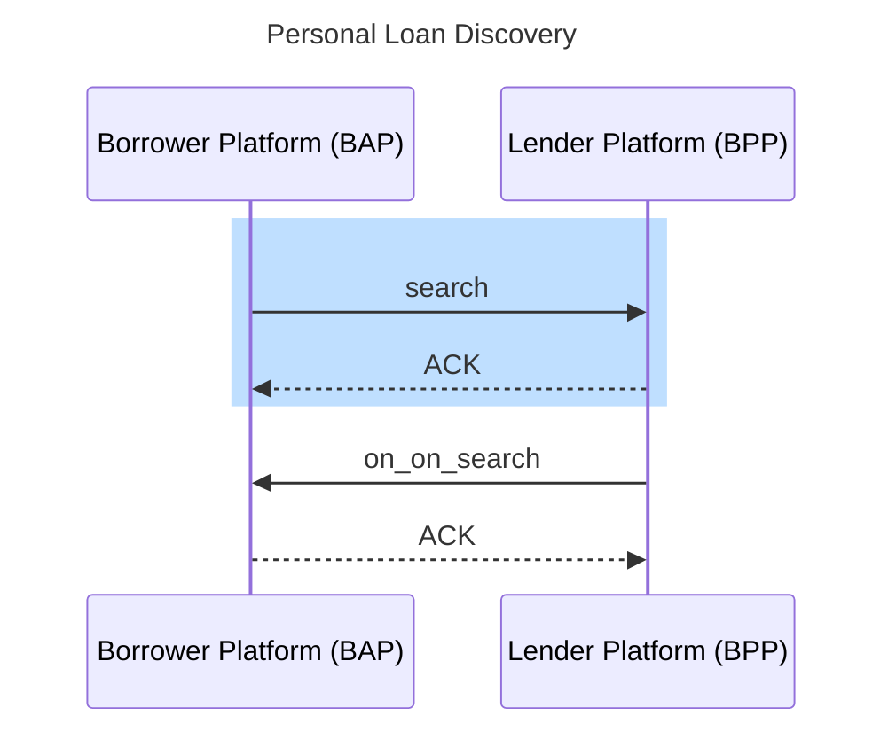
```mermaid
sequenceDiagram
  title  Personal Loan Discovery
  participant Borrower Platform (BAP)
  participant Lender Platform (BPP)
 
  rect rgb(191, 223, 255) 
  Borrower Platform (BAP)->>Lender Platform (BPP): search
  Lender Platform (BPP)-->>Borrower Platform (BAP):ACK
  end
  Lender Platform (BPP)->>Borrower Platform (BAP):on_on_search
  Borrower Platform (BAP)-->>Lender Platform (BPP): ACK
```

## on_search_1

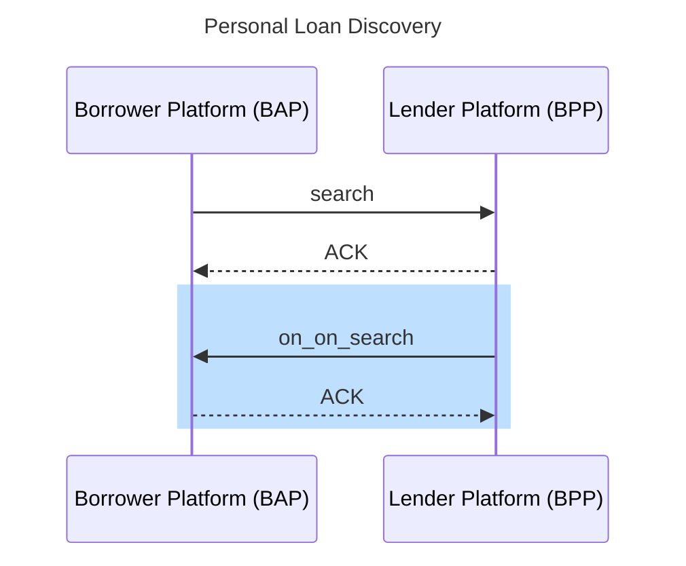
```mermaid
sequenceDiagram
  title  Personal Loan Discovery
  participant Borrower Platform (BAP)
  participant Lender Platform (BPP)
 
  Borrower Platform (BAP)->>Lender Platform (BPP): search
  Lender Platform (BPP)-->>Borrower Platform (BAP):ACK
  rect rgb(191, 223, 255) 
  Lender Platform (BPP)->>Borrower Platform (BAP):on_on_search
  Borrower Platform (BAP)-->>Lender Platform (BPP): ACK
  end
```

## select_1

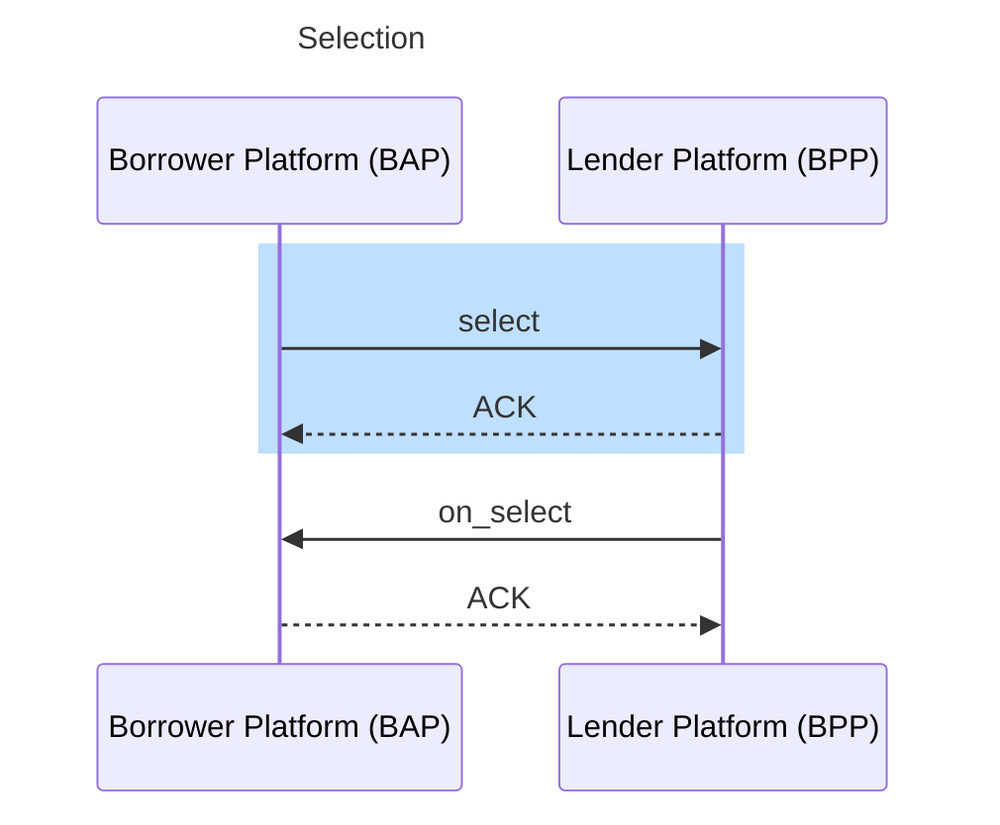
```mermaid
sequenceDiagram
  title  Selection
  participant Borrower Platform (BAP)
  participant Lender Platform (BPP)
 
  rect rgb(191, 223, 255) 
  Borrower Platform (BAP)->>Lender Platform (BPP): select
  Lender Platform (BPP)-->>Borrower Platform (BAP):ACK
  end
  Lender Platform (BPP)->>Borrower Platform (BAP):on_select
  Borrower Platform (BAP)-->>Lender Platform (BPP): ACK
```

## on_select_1

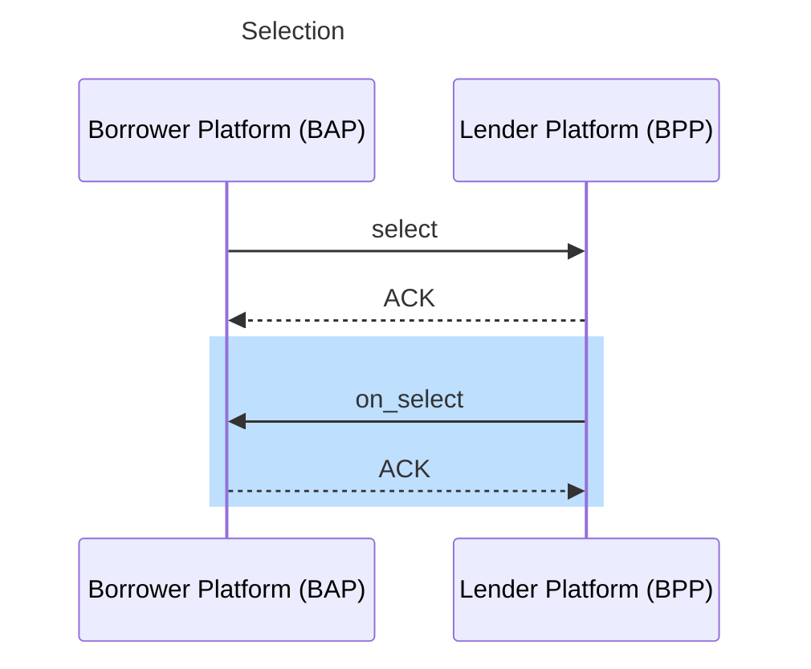
```mermaid
sequenceDiagram
  title  Selection
  participant Borrower Platform (BAP)
  participant Lender Platform (BPP)
 
  
  Borrower Platform (BAP)->>Lender Platform (BPP): select
  Lender Platform (BPP)-->>Borrower Platform (BAP):ACK
  rect rgb(191, 223, 255) 
  Lender Platform (BPP)->>Borrower Platform (BAP):on_select
  Borrower Platform (BAP)-->>Lender Platform (BPP): ACK
  end
```

## select_2

```mermaid
sequenceDiagram
  title  Selection
  participant Borrower Platform (BAP)
  participant Lender Platform (BPP)
  rect rgb(191, 223, 255) 
  Borrower Platform (BAP)->>Lender Platform (BPP): select
  Lender Platform (BPP)-->>Borrower Platform (BAP):ACK
  end
  Lender Platform (BPP)->>Borrower Platform (BAP):on_select
  Borrower Platform (BAP)-->>Lender Platform (BPP): ACK
```

## on_select_2

```mermaid
sequenceDiagram
  title  Selection
  participant Borrower Platform (BAP)
  participant Lender Platform (BPP)
  Borrower Platform (BAP)->>Lender Platform (BPP): select
  Lender Platform (BPP)-->>Borrower Platform (BAP):ACK
  rect rgb(191, 223, 255) 
  Lender Platform (BPP)->>Borrower Platform (BAP):on_select
  Borrower Platform (BAP)-->>Lender Platform (BPP): ACK
  end
```

## init_1

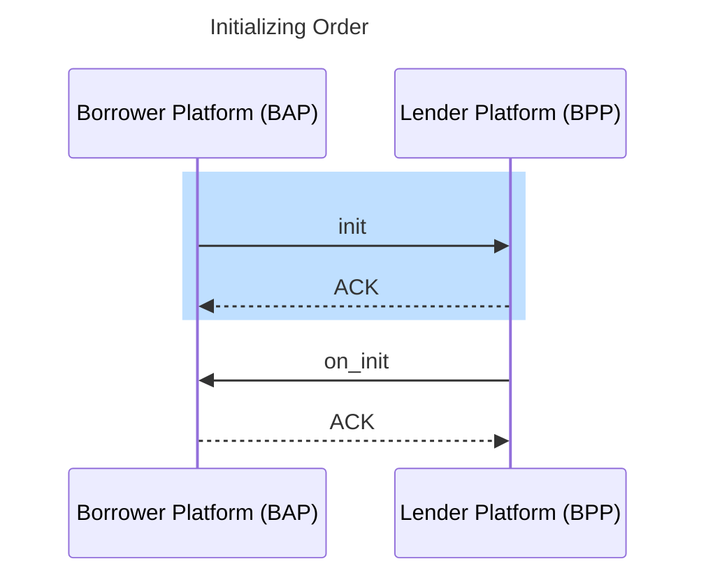
```mermaid
sequenceDiagram
  title Initializing Order
  participant Borrower Platform (BAP)
  participant Lender Platform (BPP)

  rect rgb(191, 223, 255)
  Borrower Platform (BAP)->>Lender Platform (BPP): init
  Lender Platform (BPP)-->>Borrower Platform (BAP):ACK
  end
  Lender Platform (BPP)->>Borrower Platform (BAP):on_init
  Borrower Platform (BAP)-->>Lender Platform (BPP): ACK
```

## on_init_1

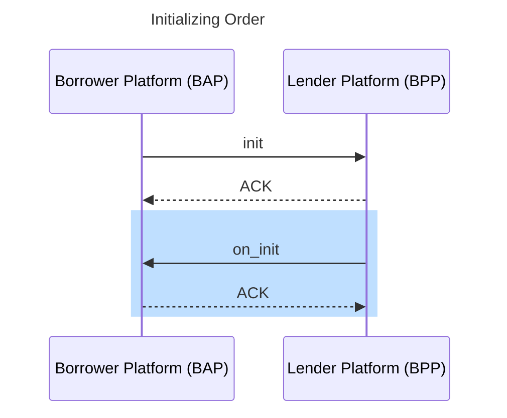
```mermaid
sequenceDiagram
 title Initializing Order
 participant Borrower Platform (BAP)
 participant Lender Platform (BPP)

 
 Borrower Platform (BAP)->>Lender Platform (BPP): init
 Lender Platform (BPP)-->>Borrower Platform (BAP):ACK
 rect rgb(191, 223, 255)
 Lender Platform (BPP)->>Borrower Platform (BAP):on_init
 Borrower Platform (BAP)-->>Lender Platform (BPP): ACK
 end
```

## kyc_form

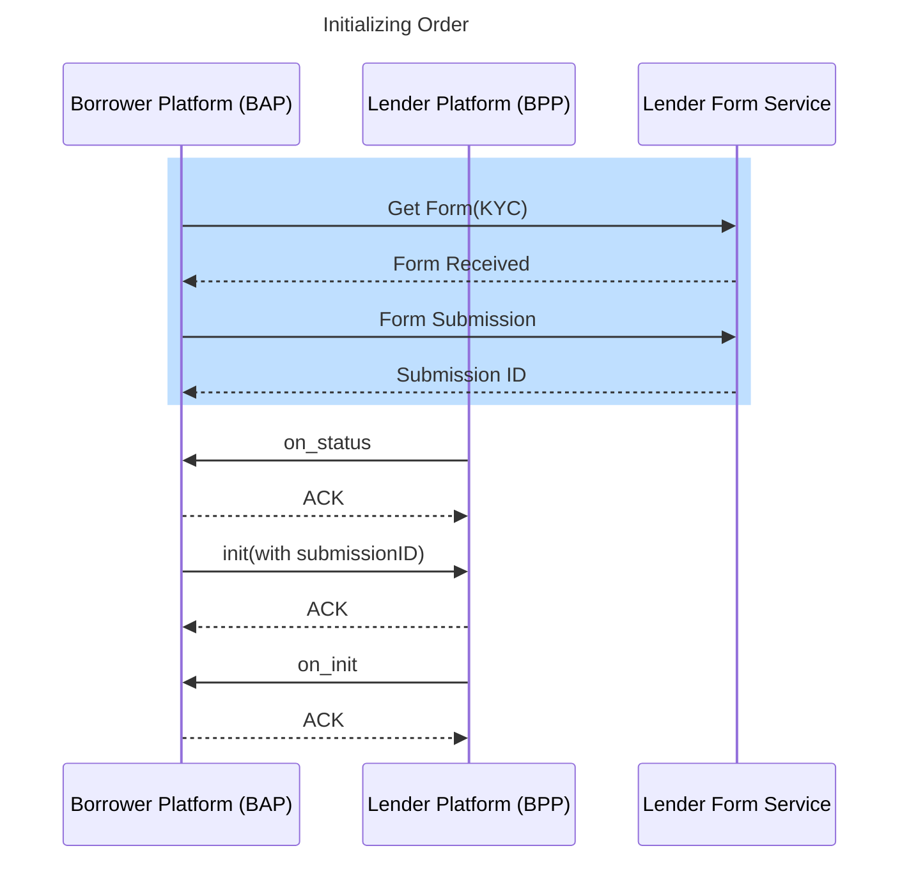
```mermaid
sequenceDiagram
  title Initializing Order
  participant Borrower Platform (BAP)
  participant Lender Platform (BPP)
  participant Lender Form Service
  rect rgb(191, 223, 255)
  Borrower Platform (BAP)->>Lender Form Service: Get Form(KYC)
  Lender Form Service-->>Borrower Platform (BAP): Form Received
  Borrower Platform (BAP)->>Lender Form Service: Form Submission
  Lender Form Service-->>Borrower Platform (BAP): Submission ID
  end
  Lender Platform (BPP)->>Borrower Platform (BAP):on_status
  Borrower Platform (BAP)-->>Lender Platform (BPP): ACK
  Borrower Platform (BAP)->>Lender Platform (BPP): init(with submissionID)
  Lender Platform (BPP)-->>Borrower Platform (BAP):ACK
  Lender Platform (BPP)->>Borrower Platform (BAP):on_init
  Borrower Platform (BAP)-->>Lender Platform (BPP): ACK
```

## on_status_1

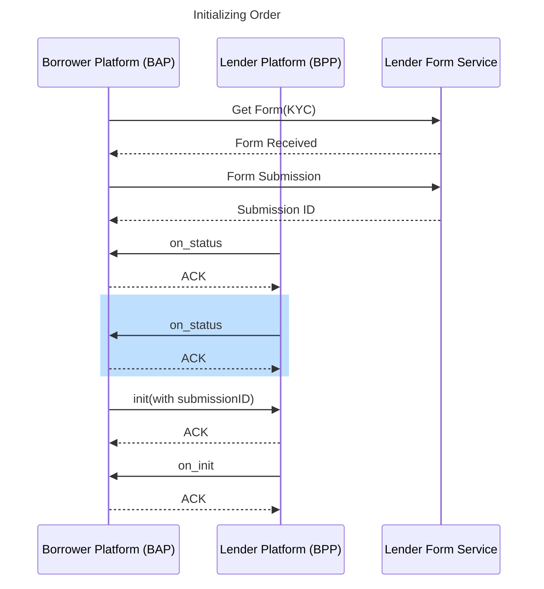
```mermaid
sequenceDiagram
  title Initializing Order
  participant Borrower Platform (BAP)
  participant Lender Platform (BPP)
  participant Lender Form Service
  Borrower Platform (BAP)->>Lender Form Service: Get Form(KYC)
  Lender Form Service-->>Borrower Platform (BAP): Form Received
  Borrower Platform (BAP)->>Lender Form Service: Form Submission
  Lender Form Service-->>Borrower Platform (BAP): Submission ID
  Lender Platform (BPP)->>Borrower Platform (BAP):on_status
  Borrower Platform (BAP)-->>Lender Platform (BPP): ACK
  rect rgb(191, 223, 255)
  Lender Platform (BPP)->>Borrower Platform (BAP):on_status
  Borrower Platform (BAP)-->>Lender Platform (BPP): ACK
  end
  Borrower Platform (BAP)->>Lender Platform (BPP): init(with submissionID)
  Lender Platform (BPP)-->>Borrower Platform (BAP):ACK
 
  Lender Platform (BPP)->>Borrower Platform (BAP):on_init
  Borrower Platform (BAP)-->>Lender Platform (BPP): ACK
  
```

## init_2

```mermaid
sequenceDiagram
  title Initializing Order
  participant Borrower Platform (BAP)
  participant Lender Platform (BPP)
  participant Lender Form Service
  Borrower Platform (BAP)->>Lender Form Service: Get Form(KYC)
  Lender Form Service-->>Borrower Platform (BAP): Form Received
  Borrower Platform (BAP)->>Lender Form Service: Form Submission
  Lender Form Service-->>Borrower Platform (BAP): Submission ID
  Lender Platform (BPP)->>Borrower Platform (BAP):on_status
  Borrower Platform (BAP)-->>Lender Platform (BPP): ACK
  rect rgb(191, 223, 255)
  Borrower Platform (BAP)->>Lender Platform (BPP): init(with submissionID)
  Lender Platform (BPP)-->>Borrower Platform (BAP):ACK
  end
  Lender Platform (BPP)->>Borrower Platform (BAP):on_init
  Borrower Platform (BAP)-->>Lender Platform (BPP): ACK
```

## on_init_2

```mermaid
sequenceDiagram
  title Initializing Order
  participant Borrower Platform (BAP)
  participant Lender Platform (BPP)
  Borrower Platform (BAP)->>Lender Platform (BPP): init(with submissionID)
  Lender Platform (BPP)-->>Borrower Platform (BAP):ACK
  rect rgb(191, 223, 255)
  Lender Platform (BPP)->>Borrower Platform (BAP):on_init
  Borrower Platform (BAP)-->>Lender Platform (BPP): ACK
  end
```

## loan_agreement

```mermaid
sequenceDiagram
  title Initializing Order
  participant Borrower Platform (BAP)
  participant Lender Platform (BPP)
  participant Lender Form Service
  rect rgb(191, 223, 255)
  Borrower Platform (BAP)->>Lender Form Service: Get Form
  Lender Form Service-->>Borrower Platform (BAP): Form Received
  Borrower Platform (BAP)->>Lender Form Service: Form Submission
  Lender Form Service-->>Borrower Platform (BAP): Submission ID
  end
  Lender Platform (BPP)->>Borrower Platform (BAP):on_status
  Borrower Platform (BAP)-->>Lender Platform (BPP): ACK
  Borrower Platform (BAP)->>Lender Platform (BPP): init(with submissionID)
  Lender Platform (BPP)-->>Borrower Platform (BAP):ACK
  Lender Platform (BPP)->>Borrower Platform (BAP):on_init
  Borrower Platform (BAP)-->>Lender Platform (BPP): ACK
```

## on_status_2

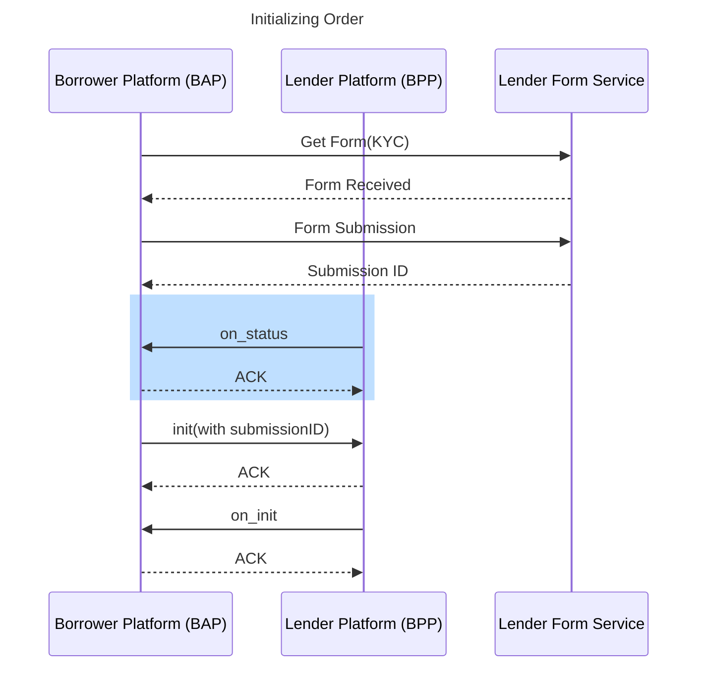
```mermaid
sequenceDiagram
  title Initializing Order
  participant Borrower Platform (BAP)
  participant Lender Platform (BPP)
  participant Lender Form Service
  Borrower Platform (BAP)->>Lender Form Service: Get Form(KYC)
  Lender Form Service-->>Borrower Platform (BAP): Form Received
  Borrower Platform (BAP)->>Lender Form Service: Form Submission
  Lender Form Service-->>Borrower Platform (BAP): Submission ID
 
  rect rgb(191, 223, 255)
  Lender Platform (BPP)->>Borrower Platform (BAP):on_status
  Borrower Platform (BAP)-->>Lender Platform (BPP): ACK
  end
  Borrower Platform (BAP)->>Lender Platform (BPP): init(with submissionID)
  Lender Platform (BPP)-->>Borrower Platform (BAP):ACK
 
  Lender Platform (BPP)->>Borrower Platform (BAP):on_init
  Borrower Platform (BAP)-->>Lender Platform (BPP): ACK
  
```

## init_3

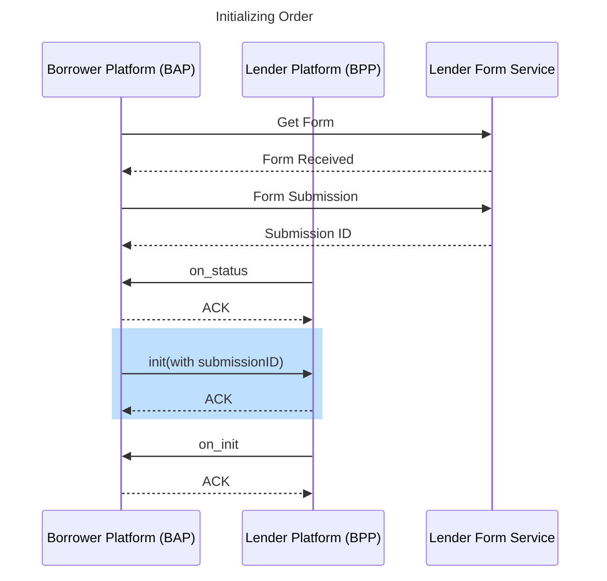
```mermaid
sequenceDiagram
  title Initializing Order
  participant Borrower Platform (BAP)
  participant Lender Platform (BPP)
  participant Lender Form Service
  Borrower Platform (BAP)->>Lender Form Service: Get Form
  Lender Form Service-->>Borrower Platform (BAP): Form Received
  Borrower Platform (BAP)->>Lender Form Service: Form Submission
  Lender Form Service-->>Borrower Platform (BAP): Submission ID
  Lender Platform (BPP)->>Borrower Platform (BAP):on_status
  Borrower Platform (BAP)-->>Lender Platform (BPP): ACK
  rect rgb(191, 223, 255)
  Borrower Platform (BAP)->>Lender Platform (BPP): init(with submissionID)
  Lender Platform (BPP)-->>Borrower Platform (BAP):ACK
  end
  Lender Platform (BPP)->>Borrower Platform (BAP):on_init
  Borrower Platform (BAP)-->>Lender Platform (BPP): ACK
```

## on_init_3

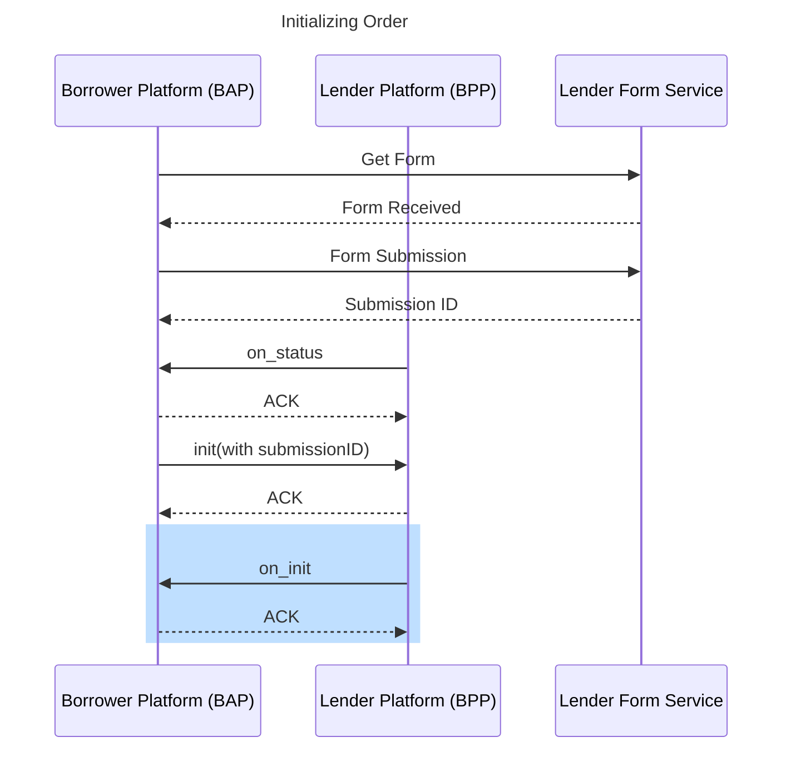
```mermaid
sequenceDiagram
  title Initializing Order
  participant Borrower Platform (BAP)
  participant Lender Platform (BPP)
  participant Lender Form Service
  Borrower Platform (BAP)->>Lender Form Service: Get Form
  Lender Form Service-->>Borrower Platform (BAP): Form Received
  Borrower Platform (BAP)->>Lender Form Service: Form Submission
  Lender Form Service-->>Borrower Platform (BAP): Submission ID
  Lender Platform (BPP)->>Borrower Platform (BAP):on_status
  Borrower Platform (BAP)-->>Lender Platform (BPP): ACK
  Borrower Platform (BAP)->>Lender Platform (BPP): init(with submissionID)
  Lender Platform (BPP)-->>Borrower Platform (BAP):ACK
  rect rgb(191, 223, 255)
  Lender Platform (BPP)->>Borrower Platform (BAP):on_init
  Borrower Platform (BAP)-->>Lender Platform (BPP): ACK
  end
```

## confirm_1

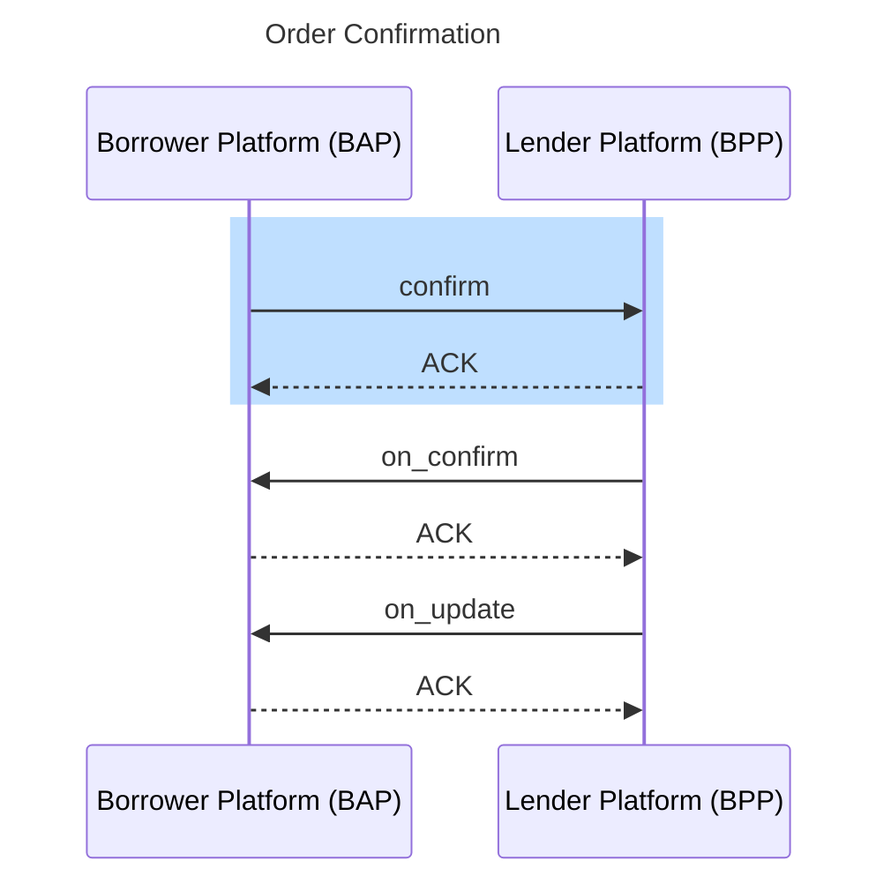
```mermaid
sequenceDiagram
  title Order Confirmation
  participant Borrower Platform (BAP)
  participant Lender Platform (BPP)

  rect rgb(191, 223, 255)
  Borrower Platform (BAP)->>Lender Platform (BPP): confirm
  Lender Platform (BPP)-->>Borrower Platform (BAP):ACK
  end
  Lender Platform (BPP)->>Borrower Platform (BAP):on_confirm
  Borrower Platform (BAP)-->>Lender Platform (BPP): ACK
  Lender Platform (BPP)->>Borrower Platform (BAP):on_update
  Borrower Platform (BAP)-->>Lender Platform (BPP): ACK
```

## on_confirm_1

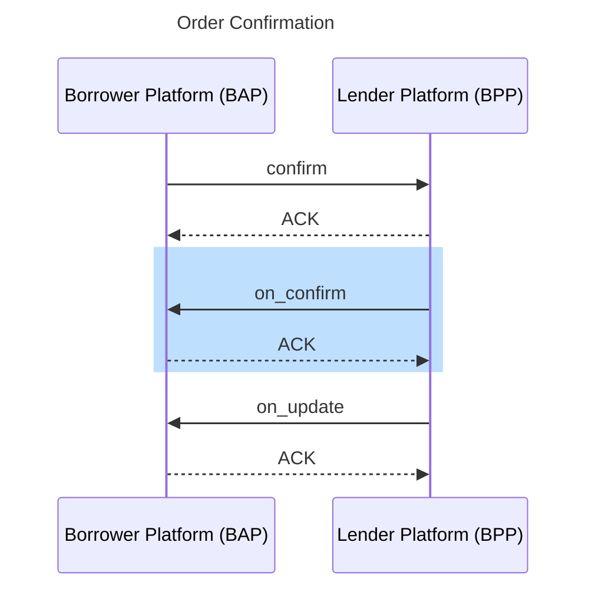
```mermaid
sequenceDiagram
  title Order Confirmation
  participant Borrower Platform (BAP)
  participant Lender Platform (BPP)
  
  Borrower Platform (BAP)->>Lender Platform (BPP): confirm
  Lender Platform (BPP)-->>Borrower Platform (BAP):ACK
  rect rgb(191, 223, 255)
  Lender Platform (BPP)->>Borrower Platform (BAP):on_confirm
  Borrower Platform (BAP)-->>Lender Platform (BPP): ACK
  end
  Lender Platform (BPP)->>Borrower Platform (BAP):on_update
  Borrower Platform (BAP)-->>Lender Platform (BPP): ACK
```

## on_update_1

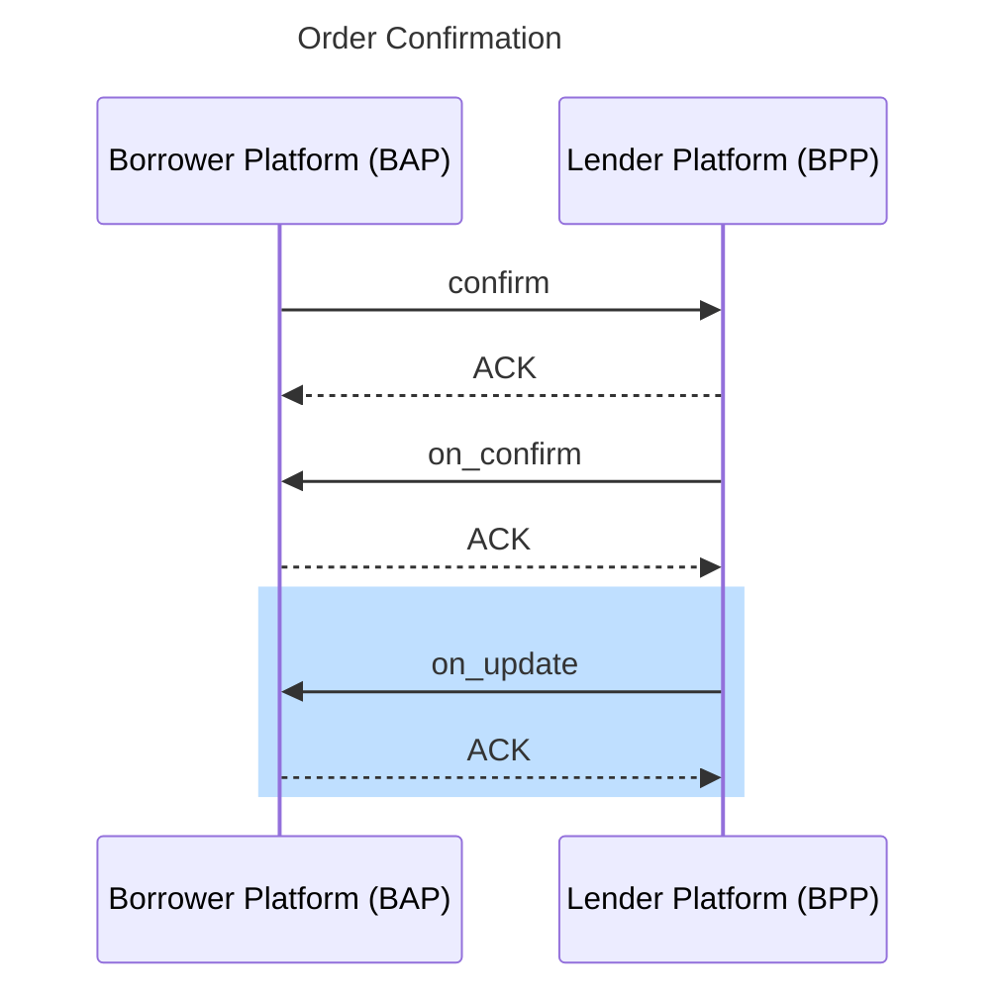
```mermaid
sequenceDiagram
  title Order Confirmation
  participant Borrower Platform (BAP)
  participant Lender Platform (BPP)
  
  Borrower Platform (BAP)->>Lender Platform (BPP): confirm
  Lender Platform (BPP)-->>Borrower Platform (BAP):ACK
 
  Lender Platform (BPP)->>Borrower Platform (BAP):on_confirm
  Borrower Platform (BAP)-->>Lender Platform (BPP): ACK
  rect rgb(191, 223, 255)
  Lender Platform (BPP)->>Borrower Platform (BAP):on_update
  Borrower Platform (BAP)-->>Lender Platform (BPP): ACK
  end
```

## update_1

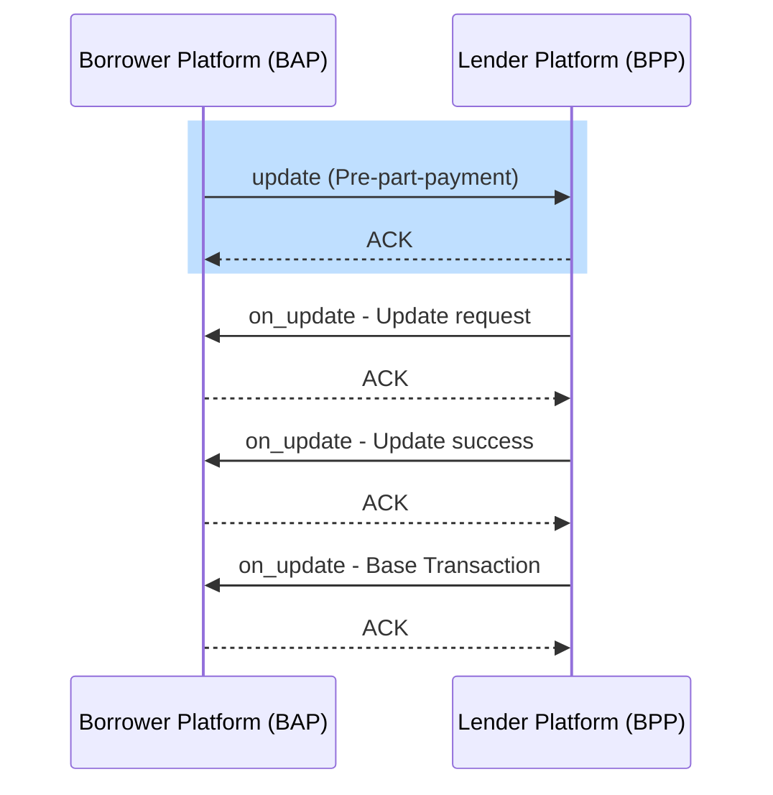
```mermaid
sequenceDiagram
  participant Borrower Platform (BAP)
  participant Lender Platform (BPP)
  rect rgb(191, 223, 255)
  Borrower Platform (BAP)->>Lender Platform (BPP): update (Pre-part-payment)
  Lender Platform (BPP)-->>Borrower Platform (BAP):ACK
  end
  Lender Platform (BPP)->>Borrower Platform (BAP):on_update - Update request
  Borrower Platform (BAP)-->>Lender Platform (BPP): ACK
  Lender Platform (BPP)->>Borrower Platform (BAP):on_update - Update success
  Borrower Platform (BAP)-->>Lender Platform (BPP): ACK
  Lender Platform (BPP)->>Borrower Platform (BAP):on_update - Base Transaction
  Borrower Platform (BAP)-->>Lender Platform (BPP): ACK
```

## on_update_2

```mermaid
sequenceDiagram
  participant Borrower Platform (BAP)
  participant Lender Platform (BPP)
  Borrower Platform (BAP)->>Lender Platform (BPP): update (Pre-part-payment)
  Lender Platform (BPP)-->>Borrower Platform (BAP):ACK
  rect rgb(191, 223, 255)
  Lender Platform (BPP)->>Borrower Platform (BAP):on_update - Update request
  Borrower Platform (BAP)-->>Lender Platform (BPP): ACK
  end
  Lender Platform (BPP)->>Borrower Platform (BAP):on_update - Update success
  Borrower Platform (BAP)-->>Lender Platform (BPP): ACK
  Lender Platform (BPP)->>Borrower Platform (BAP):on_update - Base Transaction
  Borrower Platform (BAP)-->>Lender Platform (BPP): ACK
```

## on_update_3

```mermaid
sequenceDiagram
  participant Borrower Platform (BAP)
  participant Lender Platform (BPP)
  Borrower Platform (BAP)->>Lender Platform (BPP): update (Pre-part-payment)
  Lender Platform (BPP)-->>Borrower Platform (BAP):ACK
  Lender Platform (BPP)->>Borrower Platform (BAP):on_update - Update request
  Borrower Platform (BAP)-->>Lender Platform (BPP): ACK
  rect rgb(191, 223, 255)
  Lender Platform (BPP)->>Borrower Platform (BAP):on_update - Update success
  Borrower Platform (BAP)-->>Lender Platform (BPP): ACK
  end
  Lender Platform (BPP)->>Borrower Platform (BAP):on_update - Base Transaction
  Borrower Platform (BAP)-->>Lender Platform (BPP): ACK
```
