# Buyer Initiated Return (Full Order and Partial Order) — Sequence Diagrams

Internal data file consumed by the Developer Guide's "Sequence Diagram" tab (API Walkthrough).
Not meant to be shown as its own docs page — the frontend filters this slug out of the Use Case
Brief / Additional Resources / Changelog tab lists and instead looks up the section matching the
selected API call's `action_id` (the `##` heading below) to render that step's diagram.

One `## <action_id>` heading per step of `Buyer_Initiated_Return_(Full_Order_and_Partial_Order).yaml`, in that flow's own step order, each
followed by its Mermaid `sequenceDiagram`. Derived by splitting the matching flow in this branch's own `flow-diagrams.md` (one combined diagram per whole flow) into one small diagram per individual API call, highlighting that call's own message(s) — same convention as the other domains' per-step sequence-diagram docs.

## select

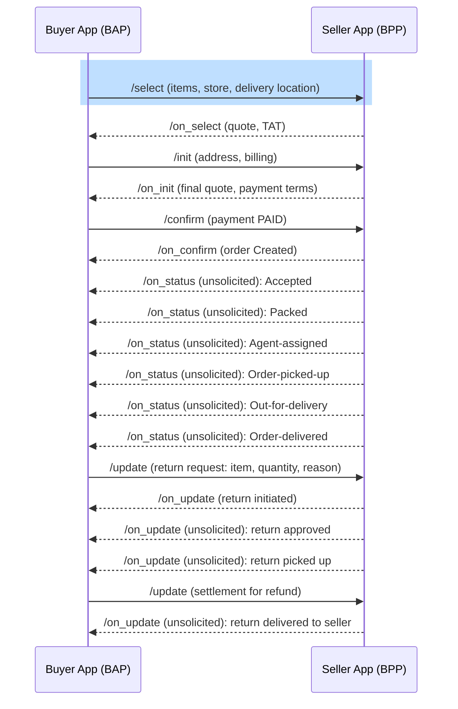
```mermaid
sequenceDiagram
  participant Buyer App (BAP)
  participant Seller App (BPP)
  rect rgb(191, 223, 255)
  Buyer App (BAP)->>Seller App (BPP): /select (items, store, delivery location)
  end
  Seller App (BPP)-->>Buyer App (BAP): /on_select (quote, TAT)
  Buyer App (BAP)->>Seller App (BPP): /init (address, billing)
  Seller App (BPP)-->>Buyer App (BAP): /on_init (final quote, payment terms)
  Buyer App (BAP)->>Seller App (BPP): /confirm (payment PAID)
  Seller App (BPP)-->>Buyer App (BAP): /on_confirm (order Created)
  Seller App (BPP)-->>Buyer App (BAP): /on_status (unsolicited): Accepted
  Seller App (BPP)-->>Buyer App (BAP): /on_status (unsolicited): Packed
  Seller App (BPP)-->>Buyer App (BAP): /on_status (unsolicited): Agent-assigned
  Seller App (BPP)-->>Buyer App (BAP): /on_status (unsolicited): Order-picked-up
  Seller App (BPP)-->>Buyer App (BAP): /on_status (unsolicited): Out-for-delivery
  Seller App (BPP)-->>Buyer App (BAP): /on_status (unsolicited): Order-delivered
  Buyer App (BAP)->>Seller App (BPP): /update (return request: item, quantity, reason)
  Seller App (BPP)-->>Buyer App (BAP): /on_update (return initiated)
  Seller App (BPP)-->>Buyer App (BAP): /on_update (unsolicited): return approved
  Seller App (BPP)-->>Buyer App (BAP): /on_update (unsolicited): return picked up
  Buyer App (BAP)->>Seller App (BPP): /update (settlement for refund)
  Seller App (BPP)-->>Buyer App (BAP): /on_update (unsolicited): return delivered to seller
```

## on_select

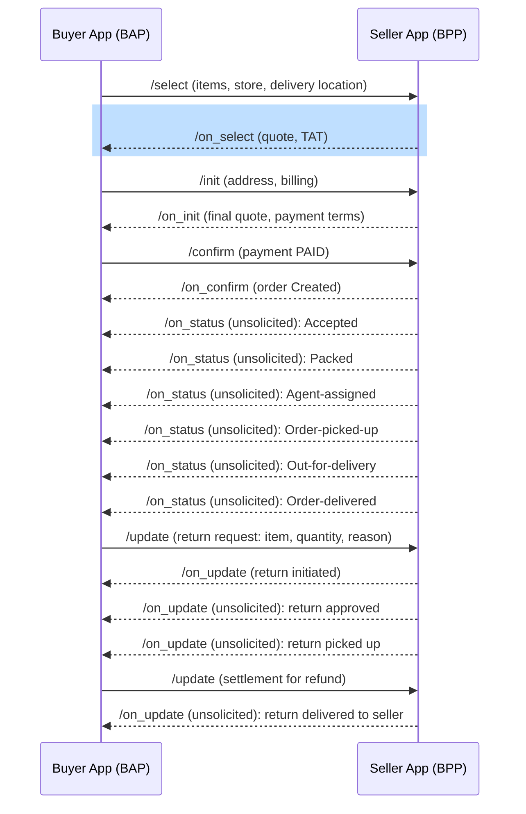
```mermaid
sequenceDiagram
  participant Buyer App (BAP)
  participant Seller App (BPP)
  Buyer App (BAP)->>Seller App (BPP): /select (items, store, delivery location)
  rect rgb(191, 223, 255)
  Seller App (BPP)-->>Buyer App (BAP): /on_select (quote, TAT)
  end
  Buyer App (BAP)->>Seller App (BPP): /init (address, billing)
  Seller App (BPP)-->>Buyer App (BAP): /on_init (final quote, payment terms)
  Buyer App (BAP)->>Seller App (BPP): /confirm (payment PAID)
  Seller App (BPP)-->>Buyer App (BAP): /on_confirm (order Created)
  Seller App (BPP)-->>Buyer App (BAP): /on_status (unsolicited): Accepted
  Seller App (BPP)-->>Buyer App (BAP): /on_status (unsolicited): Packed
  Seller App (BPP)-->>Buyer App (BAP): /on_status (unsolicited): Agent-assigned
  Seller App (BPP)-->>Buyer App (BAP): /on_status (unsolicited): Order-picked-up
  Seller App (BPP)-->>Buyer App (BAP): /on_status (unsolicited): Out-for-delivery
  Seller App (BPP)-->>Buyer App (BAP): /on_status (unsolicited): Order-delivered
  Buyer App (BAP)->>Seller App (BPP): /update (return request: item, quantity, reason)
  Seller App (BPP)-->>Buyer App (BAP): /on_update (return initiated)
  Seller App (BPP)-->>Buyer App (BAP): /on_update (unsolicited): return approved
  Seller App (BPP)-->>Buyer App (BAP): /on_update (unsolicited): return picked up
  Buyer App (BAP)->>Seller App (BPP): /update (settlement for refund)
  Seller App (BPP)-->>Buyer App (BAP): /on_update (unsolicited): return delivered to seller
```

## init

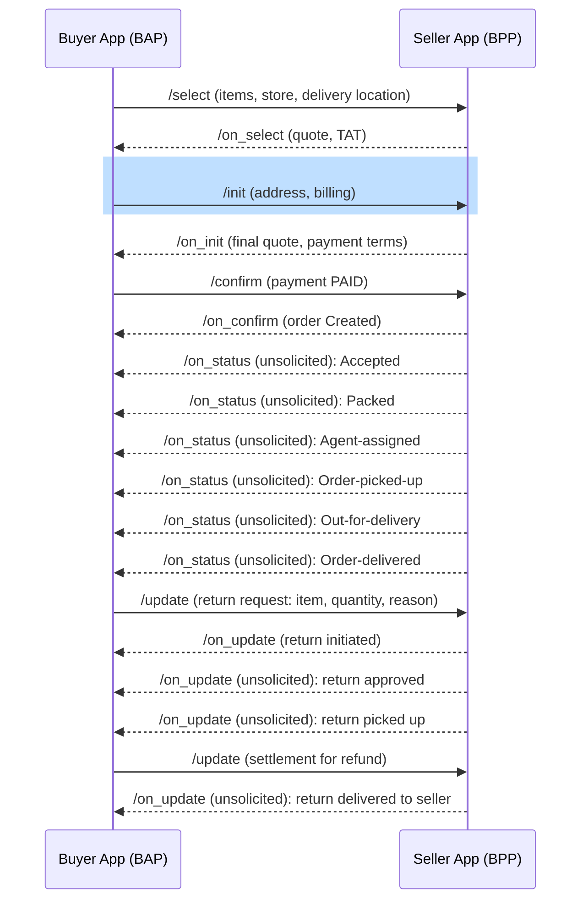
```mermaid
sequenceDiagram
  participant Buyer App (BAP)
  participant Seller App (BPP)
  Buyer App (BAP)->>Seller App (BPP): /select (items, store, delivery location)
  Seller App (BPP)-->>Buyer App (BAP): /on_select (quote, TAT)
  rect rgb(191, 223, 255)
  Buyer App (BAP)->>Seller App (BPP): /init (address, billing)
  end
  Seller App (BPP)-->>Buyer App (BAP): /on_init (final quote, payment terms)
  Buyer App (BAP)->>Seller App (BPP): /confirm (payment PAID)
  Seller App (BPP)-->>Buyer App (BAP): /on_confirm (order Created)
  Seller App (BPP)-->>Buyer App (BAP): /on_status (unsolicited): Accepted
  Seller App (BPP)-->>Buyer App (BAP): /on_status (unsolicited): Packed
  Seller App (BPP)-->>Buyer App (BAP): /on_status (unsolicited): Agent-assigned
  Seller App (BPP)-->>Buyer App (BAP): /on_status (unsolicited): Order-picked-up
  Seller App (BPP)-->>Buyer App (BAP): /on_status (unsolicited): Out-for-delivery
  Seller App (BPP)-->>Buyer App (BAP): /on_status (unsolicited): Order-delivered
  Buyer App (BAP)->>Seller App (BPP): /update (return request: item, quantity, reason)
  Seller App (BPP)-->>Buyer App (BAP): /on_update (return initiated)
  Seller App (BPP)-->>Buyer App (BAP): /on_update (unsolicited): return approved
  Seller App (BPP)-->>Buyer App (BAP): /on_update (unsolicited): return picked up
  Buyer App (BAP)->>Seller App (BPP): /update (settlement for refund)
  Seller App (BPP)-->>Buyer App (BAP): /on_update (unsolicited): return delivered to seller
```

## on_init

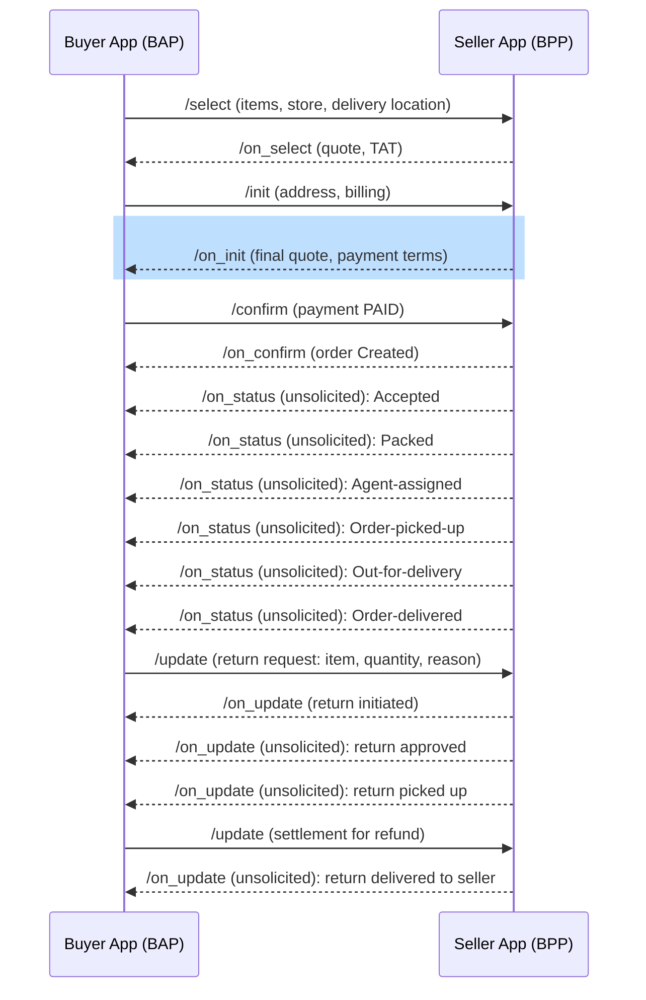
```mermaid
sequenceDiagram
  participant Buyer App (BAP)
  participant Seller App (BPP)
  Buyer App (BAP)->>Seller App (BPP): /select (items, store, delivery location)
  Seller App (BPP)-->>Buyer App (BAP): /on_select (quote, TAT)
  Buyer App (BAP)->>Seller App (BPP): /init (address, billing)
  rect rgb(191, 223, 255)
  Seller App (BPP)-->>Buyer App (BAP): /on_init (final quote, payment terms)
  end
  Buyer App (BAP)->>Seller App (BPP): /confirm (payment PAID)
  Seller App (BPP)-->>Buyer App (BAP): /on_confirm (order Created)
  Seller App (BPP)-->>Buyer App (BAP): /on_status (unsolicited): Accepted
  Seller App (BPP)-->>Buyer App (BAP): /on_status (unsolicited): Packed
  Seller App (BPP)-->>Buyer App (BAP): /on_status (unsolicited): Agent-assigned
  Seller App (BPP)-->>Buyer App (BAP): /on_status (unsolicited): Order-picked-up
  Seller App (BPP)-->>Buyer App (BAP): /on_status (unsolicited): Out-for-delivery
  Seller App (BPP)-->>Buyer App (BAP): /on_status (unsolicited): Order-delivered
  Buyer App (BAP)->>Seller App (BPP): /update (return request: item, quantity, reason)
  Seller App (BPP)-->>Buyer App (BAP): /on_update (return initiated)
  Seller App (BPP)-->>Buyer App (BAP): /on_update (unsolicited): return approved
  Seller App (BPP)-->>Buyer App (BAP): /on_update (unsolicited): return picked up
  Buyer App (BAP)->>Seller App (BPP): /update (settlement for refund)
  Seller App (BPP)-->>Buyer App (BAP): /on_update (unsolicited): return delivered to seller
```

## confirm

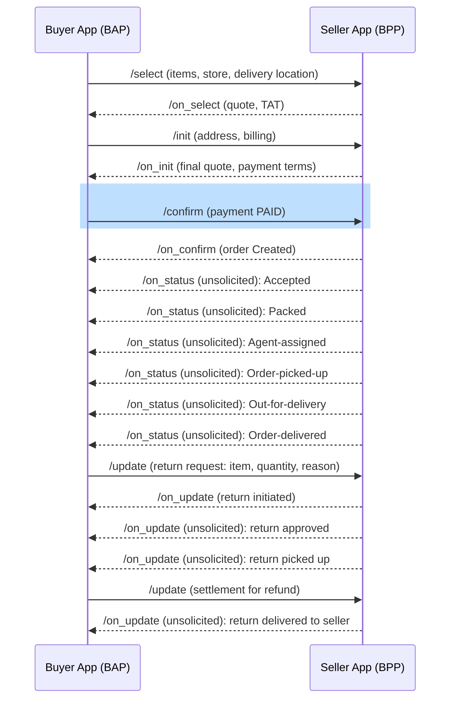
```mermaid
sequenceDiagram
  participant Buyer App (BAP)
  participant Seller App (BPP)
  Buyer App (BAP)->>Seller App (BPP): /select (items, store, delivery location)
  Seller App (BPP)-->>Buyer App (BAP): /on_select (quote, TAT)
  Buyer App (BAP)->>Seller App (BPP): /init (address, billing)
  Seller App (BPP)-->>Buyer App (BAP): /on_init (final quote, payment terms)
  rect rgb(191, 223, 255)
  Buyer App (BAP)->>Seller App (BPP): /confirm (payment PAID)
  end
  Seller App (BPP)-->>Buyer App (BAP): /on_confirm (order Created)
  Seller App (BPP)-->>Buyer App (BAP): /on_status (unsolicited): Accepted
  Seller App (BPP)-->>Buyer App (BAP): /on_status (unsolicited): Packed
  Seller App (BPP)-->>Buyer App (BAP): /on_status (unsolicited): Agent-assigned
  Seller App (BPP)-->>Buyer App (BAP): /on_status (unsolicited): Order-picked-up
  Seller App (BPP)-->>Buyer App (BAP): /on_status (unsolicited): Out-for-delivery
  Seller App (BPP)-->>Buyer App (BAP): /on_status (unsolicited): Order-delivered
  Buyer App (BAP)->>Seller App (BPP): /update (return request: item, quantity, reason)
  Seller App (BPP)-->>Buyer App (BAP): /on_update (return initiated)
  Seller App (BPP)-->>Buyer App (BAP): /on_update (unsolicited): return approved
  Seller App (BPP)-->>Buyer App (BAP): /on_update (unsolicited): return picked up
  Buyer App (BAP)->>Seller App (BPP): /update (settlement for refund)
  Seller App (BPP)-->>Buyer App (BAP): /on_update (unsolicited): return delivered to seller
```

## on_confirm

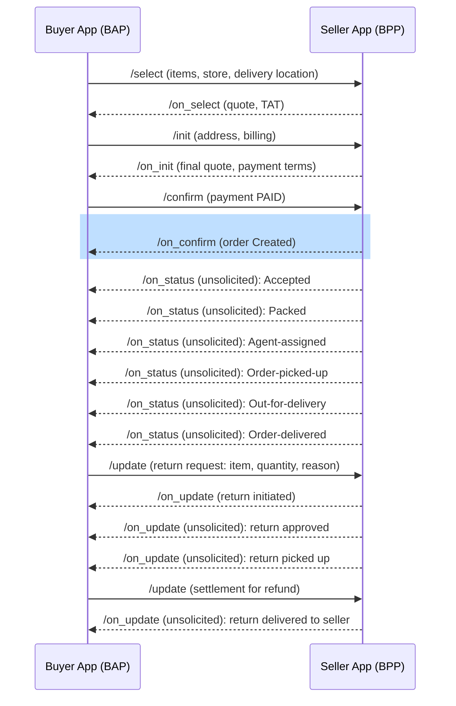
```mermaid
sequenceDiagram
  participant Buyer App (BAP)
  participant Seller App (BPP)
  Buyer App (BAP)->>Seller App (BPP): /select (items, store, delivery location)
  Seller App (BPP)-->>Buyer App (BAP): /on_select (quote, TAT)
  Buyer App (BAP)->>Seller App (BPP): /init (address, billing)
  Seller App (BPP)-->>Buyer App (BAP): /on_init (final quote, payment terms)
  Buyer App (BAP)->>Seller App (BPP): /confirm (payment PAID)
  rect rgb(191, 223, 255)
  Seller App (BPP)-->>Buyer App (BAP): /on_confirm (order Created)
  end
  Seller App (BPP)-->>Buyer App (BAP): /on_status (unsolicited): Accepted
  Seller App (BPP)-->>Buyer App (BAP): /on_status (unsolicited): Packed
  Seller App (BPP)-->>Buyer App (BAP): /on_status (unsolicited): Agent-assigned
  Seller App (BPP)-->>Buyer App (BAP): /on_status (unsolicited): Order-picked-up
  Seller App (BPP)-->>Buyer App (BAP): /on_status (unsolicited): Out-for-delivery
  Seller App (BPP)-->>Buyer App (BAP): /on_status (unsolicited): Order-delivered
  Buyer App (BAP)->>Seller App (BPP): /update (return request: item, quantity, reason)
  Seller App (BPP)-->>Buyer App (BAP): /on_update (return initiated)
  Seller App (BPP)-->>Buyer App (BAP): /on_update (unsolicited): return approved
  Seller App (BPP)-->>Buyer App (BAP): /on_update (unsolicited): return picked up
  Buyer App (BAP)->>Seller App (BPP): /update (settlement for refund)
  Seller App (BPP)-->>Buyer App (BAP): /on_update (unsolicited): return delivered to seller
```

## on_status_accepted

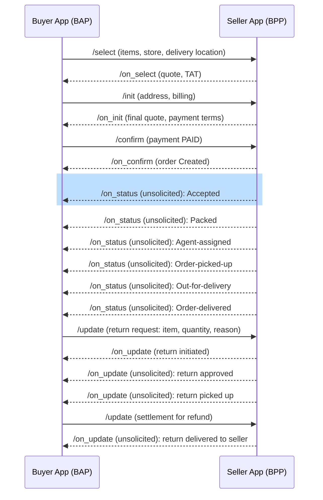
```mermaid
sequenceDiagram
  participant Buyer App (BAP)
  participant Seller App (BPP)
  Buyer App (BAP)->>Seller App (BPP): /select (items, store, delivery location)
  Seller App (BPP)-->>Buyer App (BAP): /on_select (quote, TAT)
  Buyer App (BAP)->>Seller App (BPP): /init (address, billing)
  Seller App (BPP)-->>Buyer App (BAP): /on_init (final quote, payment terms)
  Buyer App (BAP)->>Seller App (BPP): /confirm (payment PAID)
  Seller App (BPP)-->>Buyer App (BAP): /on_confirm (order Created)
  rect rgb(191, 223, 255)
  Seller App (BPP)-->>Buyer App (BAP): /on_status (unsolicited): Accepted
  end
  Seller App (BPP)-->>Buyer App (BAP): /on_status (unsolicited): Packed
  Seller App (BPP)-->>Buyer App (BAP): /on_status (unsolicited): Agent-assigned
  Seller App (BPP)-->>Buyer App (BAP): /on_status (unsolicited): Order-picked-up
  Seller App (BPP)-->>Buyer App (BAP): /on_status (unsolicited): Out-for-delivery
  Seller App (BPP)-->>Buyer App (BAP): /on_status (unsolicited): Order-delivered
  Buyer App (BAP)->>Seller App (BPP): /update (return request: item, quantity, reason)
  Seller App (BPP)-->>Buyer App (BAP): /on_update (return initiated)
  Seller App (BPP)-->>Buyer App (BAP): /on_update (unsolicited): return approved
  Seller App (BPP)-->>Buyer App (BAP): /on_update (unsolicited): return picked up
  Buyer App (BAP)->>Seller App (BPP): /update (settlement for refund)
  Seller App (BPP)-->>Buyer App (BAP): /on_update (unsolicited): return delivered to seller
```

## on_status_packed

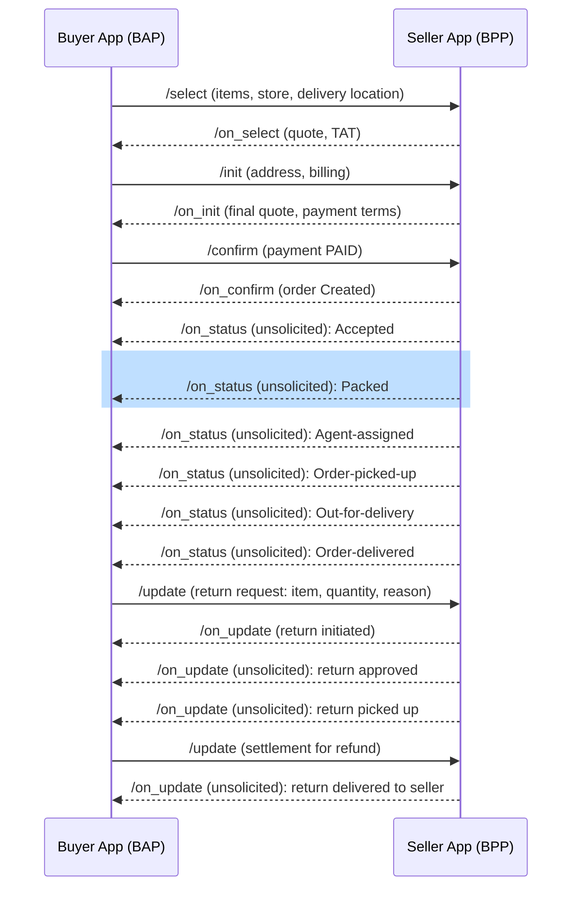
```mermaid
sequenceDiagram
  participant Buyer App (BAP)
  participant Seller App (BPP)
  Buyer App (BAP)->>Seller App (BPP): /select (items, store, delivery location)
  Seller App (BPP)-->>Buyer App (BAP): /on_select (quote, TAT)
  Buyer App (BAP)->>Seller App (BPP): /init (address, billing)
  Seller App (BPP)-->>Buyer App (BAP): /on_init (final quote, payment terms)
  Buyer App (BAP)->>Seller App (BPP): /confirm (payment PAID)
  Seller App (BPP)-->>Buyer App (BAP): /on_confirm (order Created)
  Seller App (BPP)-->>Buyer App (BAP): /on_status (unsolicited): Accepted
  rect rgb(191, 223, 255)
  Seller App (BPP)-->>Buyer App (BAP): /on_status (unsolicited): Packed
  end
  Seller App (BPP)-->>Buyer App (BAP): /on_status (unsolicited): Agent-assigned
  Seller App (BPP)-->>Buyer App (BAP): /on_status (unsolicited): Order-picked-up
  Seller App (BPP)-->>Buyer App (BAP): /on_status (unsolicited): Out-for-delivery
  Seller App (BPP)-->>Buyer App (BAP): /on_status (unsolicited): Order-delivered
  Buyer App (BAP)->>Seller App (BPP): /update (return request: item, quantity, reason)
  Seller App (BPP)-->>Buyer App (BAP): /on_update (return initiated)
  Seller App (BPP)-->>Buyer App (BAP): /on_update (unsolicited): return approved
  Seller App (BPP)-->>Buyer App (BAP): /on_update (unsolicited): return picked up
  Buyer App (BAP)->>Seller App (BPP): /update (settlement for refund)
  Seller App (BPP)-->>Buyer App (BAP): /on_update (unsolicited): return delivered to seller
```

## on_status_agent_assigned

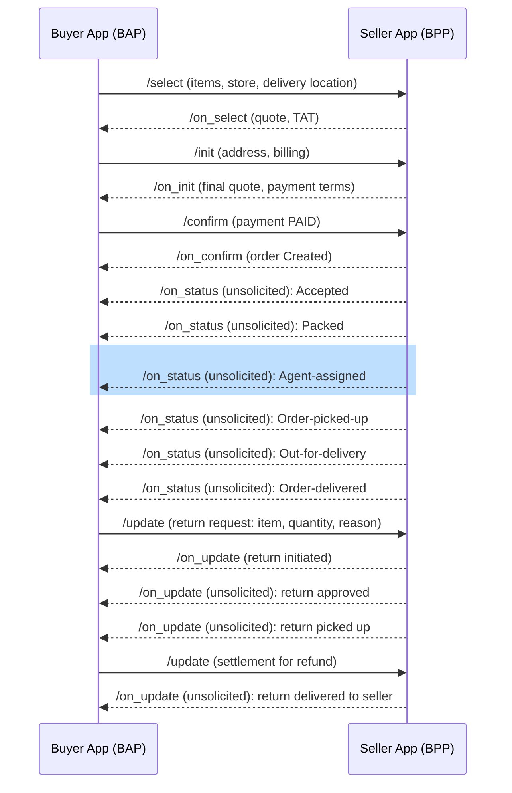
```mermaid
sequenceDiagram
  participant Buyer App (BAP)
  participant Seller App (BPP)
  Buyer App (BAP)->>Seller App (BPP): /select (items, store, delivery location)
  Seller App (BPP)-->>Buyer App (BAP): /on_select (quote, TAT)
  Buyer App (BAP)->>Seller App (BPP): /init (address, billing)
  Seller App (BPP)-->>Buyer App (BAP): /on_init (final quote, payment terms)
  Buyer App (BAP)->>Seller App (BPP): /confirm (payment PAID)
  Seller App (BPP)-->>Buyer App (BAP): /on_confirm (order Created)
  Seller App (BPP)-->>Buyer App (BAP): /on_status (unsolicited): Accepted
  Seller App (BPP)-->>Buyer App (BAP): /on_status (unsolicited): Packed
  rect rgb(191, 223, 255)
  Seller App (BPP)-->>Buyer App (BAP): /on_status (unsolicited): Agent-assigned
  end
  Seller App (BPP)-->>Buyer App (BAP): /on_status (unsolicited): Order-picked-up
  Seller App (BPP)-->>Buyer App (BAP): /on_status (unsolicited): Out-for-delivery
  Seller App (BPP)-->>Buyer App (BAP): /on_status (unsolicited): Order-delivered
  Buyer App (BAP)->>Seller App (BPP): /update (return request: item, quantity, reason)
  Seller App (BPP)-->>Buyer App (BAP): /on_update (return initiated)
  Seller App (BPP)-->>Buyer App (BAP): /on_update (unsolicited): return approved
  Seller App (BPP)-->>Buyer App (BAP): /on_update (unsolicited): return picked up
  Buyer App (BAP)->>Seller App (BPP): /update (settlement for refund)
  Seller App (BPP)-->>Buyer App (BAP): /on_update (unsolicited): return delivered to seller
```

## on_status_picked

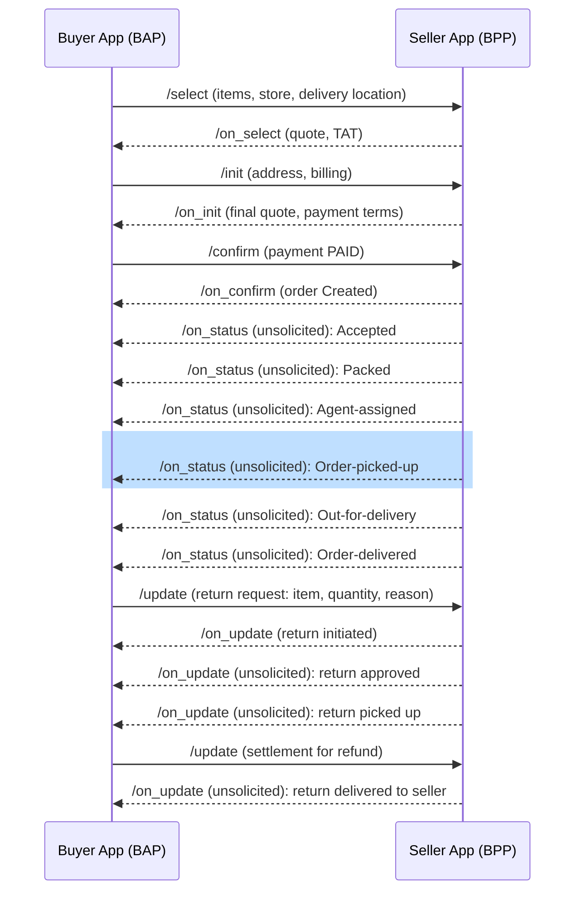
```mermaid
sequenceDiagram
  participant Buyer App (BAP)
  participant Seller App (BPP)
  Buyer App (BAP)->>Seller App (BPP): /select (items, store, delivery location)
  Seller App (BPP)-->>Buyer App (BAP): /on_select (quote, TAT)
  Buyer App (BAP)->>Seller App (BPP): /init (address, billing)
  Seller App (BPP)-->>Buyer App (BAP): /on_init (final quote, payment terms)
  Buyer App (BAP)->>Seller App (BPP): /confirm (payment PAID)
  Seller App (BPP)-->>Buyer App (BAP): /on_confirm (order Created)
  Seller App (BPP)-->>Buyer App (BAP): /on_status (unsolicited): Accepted
  Seller App (BPP)-->>Buyer App (BAP): /on_status (unsolicited): Packed
  Seller App (BPP)-->>Buyer App (BAP): /on_status (unsolicited): Agent-assigned
  rect rgb(191, 223, 255)
  Seller App (BPP)-->>Buyer App (BAP): /on_status (unsolicited): Order-picked-up
  end
  Seller App (BPP)-->>Buyer App (BAP): /on_status (unsolicited): Out-for-delivery
  Seller App (BPP)-->>Buyer App (BAP): /on_status (unsolicited): Order-delivered
  Buyer App (BAP)->>Seller App (BPP): /update (return request: item, quantity, reason)
  Seller App (BPP)-->>Buyer App (BAP): /on_update (return initiated)
  Seller App (BPP)-->>Buyer App (BAP): /on_update (unsolicited): return approved
  Seller App (BPP)-->>Buyer App (BAP): /on_update (unsolicited): return picked up
  Buyer App (BAP)->>Seller App (BPP): /update (settlement for refund)
  Seller App (BPP)-->>Buyer App (BAP): /on_update (unsolicited): return delivered to seller
```

## on_status_out_for_delivery

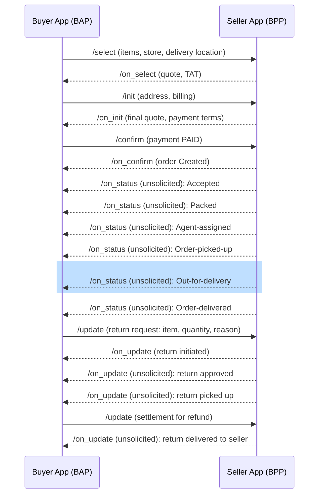
```mermaid
sequenceDiagram
  participant Buyer App (BAP)
  participant Seller App (BPP)
  Buyer App (BAP)->>Seller App (BPP): /select (items, store, delivery location)
  Seller App (BPP)-->>Buyer App (BAP): /on_select (quote, TAT)
  Buyer App (BAP)->>Seller App (BPP): /init (address, billing)
  Seller App (BPP)-->>Buyer App (BAP): /on_init (final quote, payment terms)
  Buyer App (BAP)->>Seller App (BPP): /confirm (payment PAID)
  Seller App (BPP)-->>Buyer App (BAP): /on_confirm (order Created)
  Seller App (BPP)-->>Buyer App (BAP): /on_status (unsolicited): Accepted
  Seller App (BPP)-->>Buyer App (BAP): /on_status (unsolicited): Packed
  Seller App (BPP)-->>Buyer App (BAP): /on_status (unsolicited): Agent-assigned
  Seller App (BPP)-->>Buyer App (BAP): /on_status (unsolicited): Order-picked-up
  rect rgb(191, 223, 255)
  Seller App (BPP)-->>Buyer App (BAP): /on_status (unsolicited): Out-for-delivery
  end
  Seller App (BPP)-->>Buyer App (BAP): /on_status (unsolicited): Order-delivered
  Buyer App (BAP)->>Seller App (BPP): /update (return request: item, quantity, reason)
  Seller App (BPP)-->>Buyer App (BAP): /on_update (return initiated)
  Seller App (BPP)-->>Buyer App (BAP): /on_update (unsolicited): return approved
  Seller App (BPP)-->>Buyer App (BAP): /on_update (unsolicited): return picked up
  Buyer App (BAP)->>Seller App (BPP): /update (settlement for refund)
  Seller App (BPP)-->>Buyer App (BAP): /on_update (unsolicited): return delivered to seller
```

## on_status_order_delivered

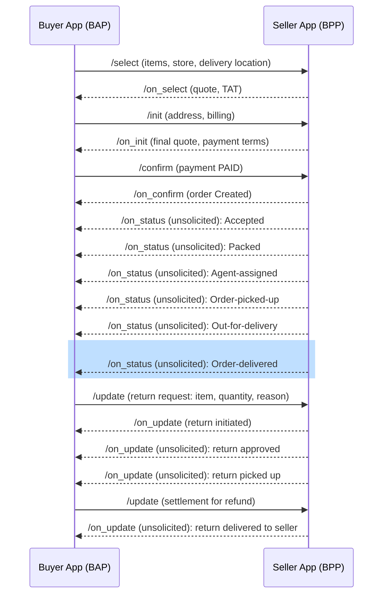
```mermaid
sequenceDiagram
  participant Buyer App (BAP)
  participant Seller App (BPP)
  Buyer App (BAP)->>Seller App (BPP): /select (items, store, delivery location)
  Seller App (BPP)-->>Buyer App (BAP): /on_select (quote, TAT)
  Buyer App (BAP)->>Seller App (BPP): /init (address, billing)
  Seller App (BPP)-->>Buyer App (BAP): /on_init (final quote, payment terms)
  Buyer App (BAP)->>Seller App (BPP): /confirm (payment PAID)
  Seller App (BPP)-->>Buyer App (BAP): /on_confirm (order Created)
  Seller App (BPP)-->>Buyer App (BAP): /on_status (unsolicited): Accepted
  Seller App (BPP)-->>Buyer App (BAP): /on_status (unsolicited): Packed
  Seller App (BPP)-->>Buyer App (BAP): /on_status (unsolicited): Agent-assigned
  Seller App (BPP)-->>Buyer App (BAP): /on_status (unsolicited): Order-picked-up
  Seller App (BPP)-->>Buyer App (BAP): /on_status (unsolicited): Out-for-delivery
  rect rgb(191, 223, 255)
  Seller App (BPP)-->>Buyer App (BAP): /on_status (unsolicited): Order-delivered
  end
  Buyer App (BAP)->>Seller App (BPP): /update (return request: item, quantity, reason)
  Seller App (BPP)-->>Buyer App (BAP): /on_update (return initiated)
  Seller App (BPP)-->>Buyer App (BAP): /on_update (unsolicited): return approved
  Seller App (BPP)-->>Buyer App (BAP): /on_update (unsolicited): return picked up
  Buyer App (BAP)->>Seller App (BPP): /update (settlement for refund)
  Seller App (BPP)-->>Buyer App (BAP): /on_update (unsolicited): return delivered to seller
```

## update_return

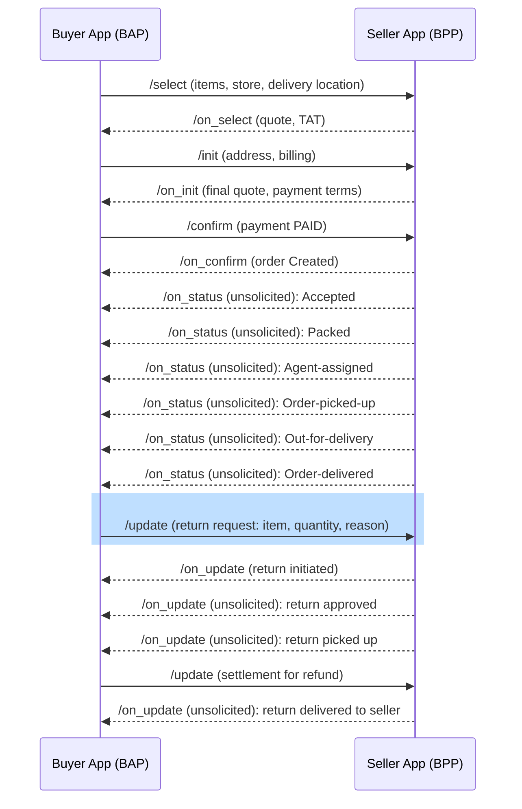
```mermaid
sequenceDiagram
  participant Buyer App (BAP)
  participant Seller App (BPP)
  Buyer App (BAP)->>Seller App (BPP): /select (items, store, delivery location)
  Seller App (BPP)-->>Buyer App (BAP): /on_select (quote, TAT)
  Buyer App (BAP)->>Seller App (BPP): /init (address, billing)
  Seller App (BPP)-->>Buyer App (BAP): /on_init (final quote, payment terms)
  Buyer App (BAP)->>Seller App (BPP): /confirm (payment PAID)
  Seller App (BPP)-->>Buyer App (BAP): /on_confirm (order Created)
  Seller App (BPP)-->>Buyer App (BAP): /on_status (unsolicited): Accepted
  Seller App (BPP)-->>Buyer App (BAP): /on_status (unsolicited): Packed
  Seller App (BPP)-->>Buyer App (BAP): /on_status (unsolicited): Agent-assigned
  Seller App (BPP)-->>Buyer App (BAP): /on_status (unsolicited): Order-picked-up
  Seller App (BPP)-->>Buyer App (BAP): /on_status (unsolicited): Out-for-delivery
  Seller App (BPP)-->>Buyer App (BAP): /on_status (unsolicited): Order-delivered
  rect rgb(191, 223, 255)
  Buyer App (BAP)->>Seller App (BPP): /update (return request: item, quantity, reason)
  end
  Seller App (BPP)-->>Buyer App (BAP): /on_update (return initiated)
  Seller App (BPP)-->>Buyer App (BAP): /on_update (unsolicited): return approved
  Seller App (BPP)-->>Buyer App (BAP): /on_update (unsolicited): return picked up
  Buyer App (BAP)->>Seller App (BPP): /update (settlement for refund)
  Seller App (BPP)-->>Buyer App (BAP): /on_update (unsolicited): return delivered to seller
```

## on_update_return_init

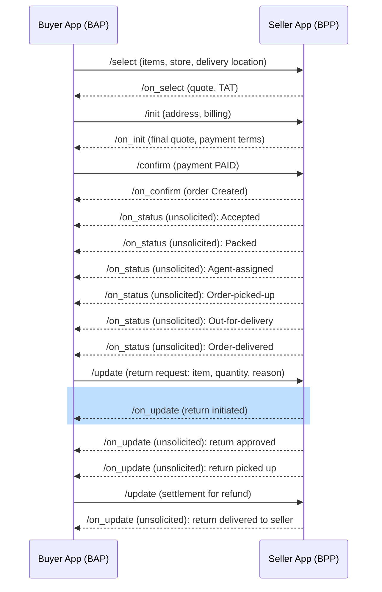
```mermaid
sequenceDiagram
  participant Buyer App (BAP)
  participant Seller App (BPP)
  Buyer App (BAP)->>Seller App (BPP): /select (items, store, delivery location)
  Seller App (BPP)-->>Buyer App (BAP): /on_select (quote, TAT)
  Buyer App (BAP)->>Seller App (BPP): /init (address, billing)
  Seller App (BPP)-->>Buyer App (BAP): /on_init (final quote, payment terms)
  Buyer App (BAP)->>Seller App (BPP): /confirm (payment PAID)
  Seller App (BPP)-->>Buyer App (BAP): /on_confirm (order Created)
  Seller App (BPP)-->>Buyer App (BAP): /on_status (unsolicited): Accepted
  Seller App (BPP)-->>Buyer App (BAP): /on_status (unsolicited): Packed
  Seller App (BPP)-->>Buyer App (BAP): /on_status (unsolicited): Agent-assigned
  Seller App (BPP)-->>Buyer App (BAP): /on_status (unsolicited): Order-picked-up
  Seller App (BPP)-->>Buyer App (BAP): /on_status (unsolicited): Out-for-delivery
  Seller App (BPP)-->>Buyer App (BAP): /on_status (unsolicited): Order-delivered
  Buyer App (BAP)->>Seller App (BPP): /update (return request: item, quantity, reason)
  rect rgb(191, 223, 255)
  Seller App (BPP)-->>Buyer App (BAP): /on_update (return initiated)
  end
  Seller App (BPP)-->>Buyer App (BAP): /on_update (unsolicited): return approved
  Seller App (BPP)-->>Buyer App (BAP): /on_update (unsolicited): return picked up
  Buyer App (BAP)->>Seller App (BPP): /update (settlement for refund)
  Seller App (BPP)-->>Buyer App (BAP): /on_update (unsolicited): return delivered to seller
```

## on_update_return_approved

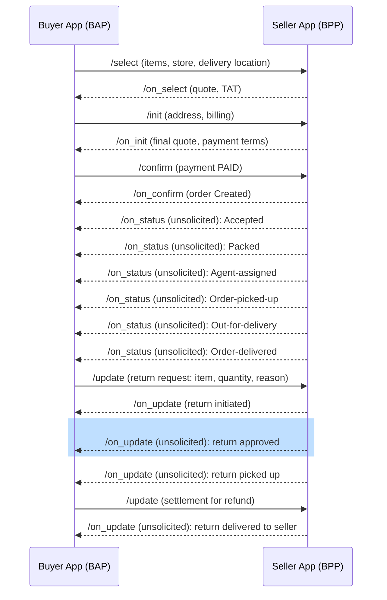
```mermaid
sequenceDiagram
  participant Buyer App (BAP)
  participant Seller App (BPP)
  Buyer App (BAP)->>Seller App (BPP): /select (items, store, delivery location)
  Seller App (BPP)-->>Buyer App (BAP): /on_select (quote, TAT)
  Buyer App (BAP)->>Seller App (BPP): /init (address, billing)
  Seller App (BPP)-->>Buyer App (BAP): /on_init (final quote, payment terms)
  Buyer App (BAP)->>Seller App (BPP): /confirm (payment PAID)
  Seller App (BPP)-->>Buyer App (BAP): /on_confirm (order Created)
  Seller App (BPP)-->>Buyer App (BAP): /on_status (unsolicited): Accepted
  Seller App (BPP)-->>Buyer App (BAP): /on_status (unsolicited): Packed
  Seller App (BPP)-->>Buyer App (BAP): /on_status (unsolicited): Agent-assigned
  Seller App (BPP)-->>Buyer App (BAP): /on_status (unsolicited): Order-picked-up
  Seller App (BPP)-->>Buyer App (BAP): /on_status (unsolicited): Out-for-delivery
  Seller App (BPP)-->>Buyer App (BAP): /on_status (unsolicited): Order-delivered
  Buyer App (BAP)->>Seller App (BPP): /update (return request: item, quantity, reason)
  Seller App (BPP)-->>Buyer App (BAP): /on_update (return initiated)
  rect rgb(191, 223, 255)
  Seller App (BPP)-->>Buyer App (BAP): /on_update (unsolicited): return approved
  end
  Seller App (BPP)-->>Buyer App (BAP): /on_update (unsolicited): return picked up
  Buyer App (BAP)->>Seller App (BPP): /update (settlement for refund)
  Seller App (BPP)-->>Buyer App (BAP): /on_update (unsolicited): return delivered to seller
```

## on_update_return_picked

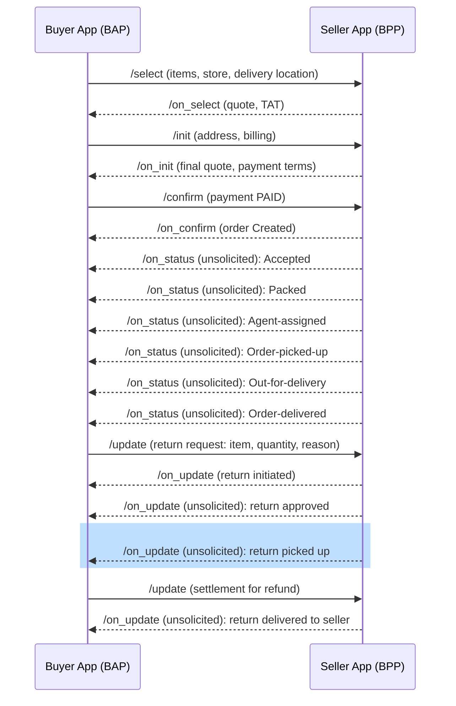
```mermaid
sequenceDiagram
  participant Buyer App (BAP)
  participant Seller App (BPP)
  Buyer App (BAP)->>Seller App (BPP): /select (items, store, delivery location)
  Seller App (BPP)-->>Buyer App (BAP): /on_select (quote, TAT)
  Buyer App (BAP)->>Seller App (BPP): /init (address, billing)
  Seller App (BPP)-->>Buyer App (BAP): /on_init (final quote, payment terms)
  Buyer App (BAP)->>Seller App (BPP): /confirm (payment PAID)
  Seller App (BPP)-->>Buyer App (BAP): /on_confirm (order Created)
  Seller App (BPP)-->>Buyer App (BAP): /on_status (unsolicited): Accepted
  Seller App (BPP)-->>Buyer App (BAP): /on_status (unsolicited): Packed
  Seller App (BPP)-->>Buyer App (BAP): /on_status (unsolicited): Agent-assigned
  Seller App (BPP)-->>Buyer App (BAP): /on_status (unsolicited): Order-picked-up
  Seller App (BPP)-->>Buyer App (BAP): /on_status (unsolicited): Out-for-delivery
  Seller App (BPP)-->>Buyer App (BAP): /on_status (unsolicited): Order-delivered
  Buyer App (BAP)->>Seller App (BPP): /update (return request: item, quantity, reason)
  Seller App (BPP)-->>Buyer App (BAP): /on_update (return initiated)
  Seller App (BPP)-->>Buyer App (BAP): /on_update (unsolicited): return approved
  rect rgb(191, 223, 255)
  Seller App (BPP)-->>Buyer App (BAP): /on_update (unsolicited): return picked up
  end
  Buyer App (BAP)->>Seller App (BPP): /update (settlement for refund)
  Seller App (BPP)-->>Buyer App (BAP): /on_update (unsolicited): return delivered to seller
```

## update_settlement_trail

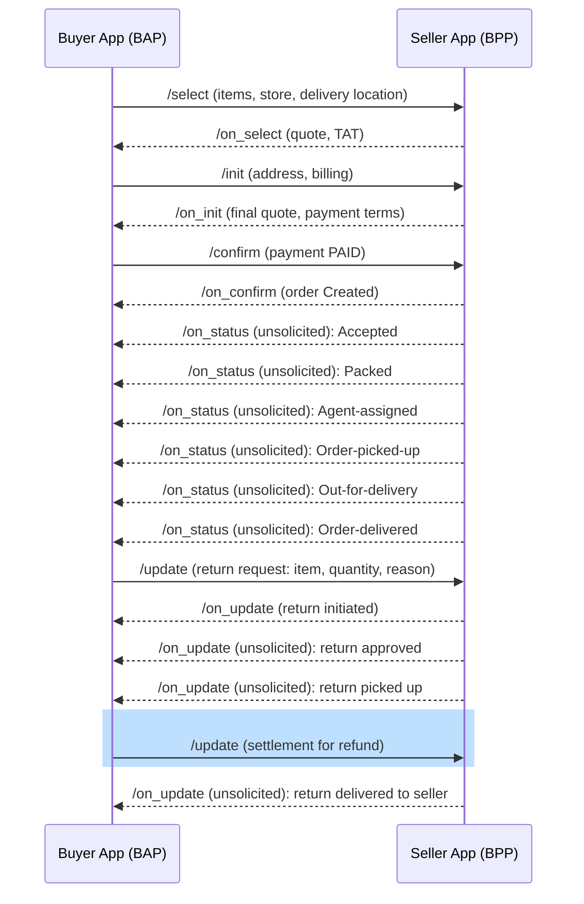
```mermaid
sequenceDiagram
  participant Buyer App (BAP)
  participant Seller App (BPP)
  Buyer App (BAP)->>Seller App (BPP): /select (items, store, delivery location)
  Seller App (BPP)-->>Buyer App (BAP): /on_select (quote, TAT)
  Buyer App (BAP)->>Seller App (BPP): /init (address, billing)
  Seller App (BPP)-->>Buyer App (BAP): /on_init (final quote, payment terms)
  Buyer App (BAP)->>Seller App (BPP): /confirm (payment PAID)
  Seller App (BPP)-->>Buyer App (BAP): /on_confirm (order Created)
  Seller App (BPP)-->>Buyer App (BAP): /on_status (unsolicited): Accepted
  Seller App (BPP)-->>Buyer App (BAP): /on_status (unsolicited): Packed
  Seller App (BPP)-->>Buyer App (BAP): /on_status (unsolicited): Agent-assigned
  Seller App (BPP)-->>Buyer App (BAP): /on_status (unsolicited): Order-picked-up
  Seller App (BPP)-->>Buyer App (BAP): /on_status (unsolicited): Out-for-delivery
  Seller App (BPP)-->>Buyer App (BAP): /on_status (unsolicited): Order-delivered
  Buyer App (BAP)->>Seller App (BPP): /update (return request: item, quantity, reason)
  Seller App (BPP)-->>Buyer App (BAP): /on_update (return initiated)
  Seller App (BPP)-->>Buyer App (BAP): /on_update (unsolicited): return approved
  Seller App (BPP)-->>Buyer App (BAP): /on_update (unsolicited): return picked up
  rect rgb(191, 223, 255)
  Buyer App (BAP)->>Seller App (BPP): /update (settlement for refund)
  end
  Seller App (BPP)-->>Buyer App (BAP): /on_update (unsolicited): return delivered to seller
```

## on_update_return_delivered

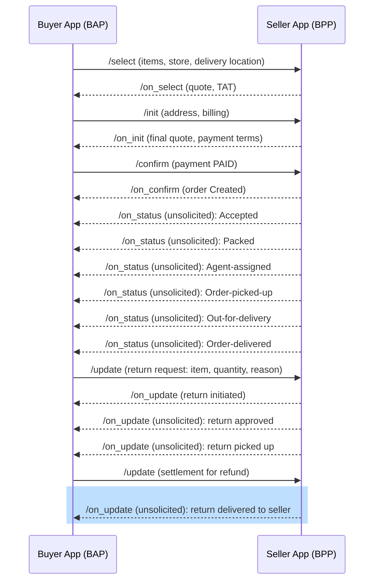
```mermaid
sequenceDiagram
  participant Buyer App (BAP)
  participant Seller App (BPP)
  Buyer App (BAP)->>Seller App (BPP): /select (items, store, delivery location)
  Seller App (BPP)-->>Buyer App (BAP): /on_select (quote, TAT)
  Buyer App (BAP)->>Seller App (BPP): /init (address, billing)
  Seller App (BPP)-->>Buyer App (BAP): /on_init (final quote, payment terms)
  Buyer App (BAP)->>Seller App (BPP): /confirm (payment PAID)
  Seller App (BPP)-->>Buyer App (BAP): /on_confirm (order Created)
  Seller App (BPP)-->>Buyer App (BAP): /on_status (unsolicited): Accepted
  Seller App (BPP)-->>Buyer App (BAP): /on_status (unsolicited): Packed
  Seller App (BPP)-->>Buyer App (BAP): /on_status (unsolicited): Agent-assigned
  Seller App (BPP)-->>Buyer App (BAP): /on_status (unsolicited): Order-picked-up
  Seller App (BPP)-->>Buyer App (BAP): /on_status (unsolicited): Out-for-delivery
  Seller App (BPP)-->>Buyer App (BAP): /on_status (unsolicited): Order-delivered
  Buyer App (BAP)->>Seller App (BPP): /update (return request: item, quantity, reason)
  Seller App (BPP)-->>Buyer App (BAP): /on_update (return initiated)
  Seller App (BPP)-->>Buyer App (BAP): /on_update (unsolicited): return approved
  Seller App (BPP)-->>Buyer App (BAP): /on_update (unsolicited): return picked up
  Buyer App (BAP)->>Seller App (BPP): /update (settlement for refund)
  rect rgb(191, 223, 255)
  Seller App (BPP)-->>Buyer App (BAP): /on_update (unsolicited): return delivered to seller
  end
```
