# Personal Loan Single Redirection With IGM v-1 0 0  — Sequence Diagrams

Internal data file consumed by the Developer Guide's "Sequence Diagram" tab (API Walkthrough).
Not meant to be shown as its own docs page — the frontend filters this slug out of the Use Case
Brief / Additional Resources / Changelog tab lists and instead looks up the section matching the
selected API call's `action_id` (the `##` heading below) to render that step's diagram.

One `## <action_id>` heading per step of `Personal_Loan_Single_Redirection_With_IGM_v-1_0_0_.yaml`, in that flow's own step order, each
followed by its Mermaid `sequenceDiagram`. The issue/on_issue/issue_status/on_issue_status steps
(IGM) have no counterpart in ONDC-FIS-Specifications -- their diagrams are drafted from the
standard ONDC IGM protocol shape (raise -> ack -> status query -> status response -> unsolicited
resolution -> close), not sourced from that repo.

## search_personal_loan_3

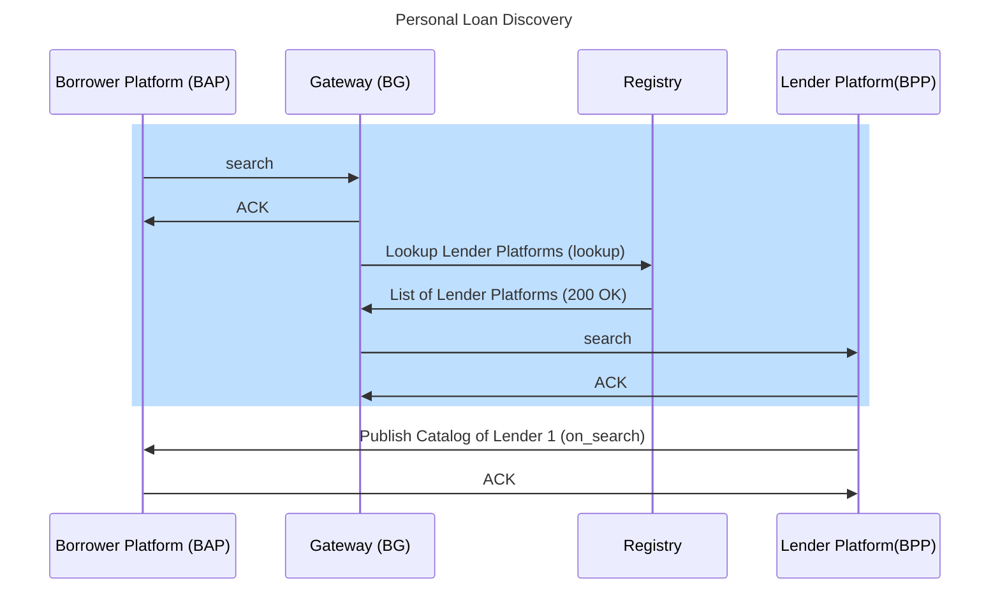
```mermaid
sequenceDiagram
  title Personal Loan Discovery
  rect rgb(191, 223, 255)
  Borrower Platform (BAP)->>Gateway (BG): search
  Gateway (BG) ->> Borrower Platform (BAP): ACK
  Gateway (BG)->>Registry: Lookup Lender Platforms (lookup)
  Registry->>Gateway (BG): List of Lender Platforms (200 OK)
  Gateway (BG)->>Lender Platform(BPP): search
  Lender Platform(BPP)->>Gateway (BG) : ACK
  end
  Lender Platform(BPP)->>Borrower Platform (BAP): Publish Catalog of Lender 1 (on_search)
  Borrower Platform (BAP)->>Lender Platform(BPP): ACK
```

## on_search_personal_loan_3

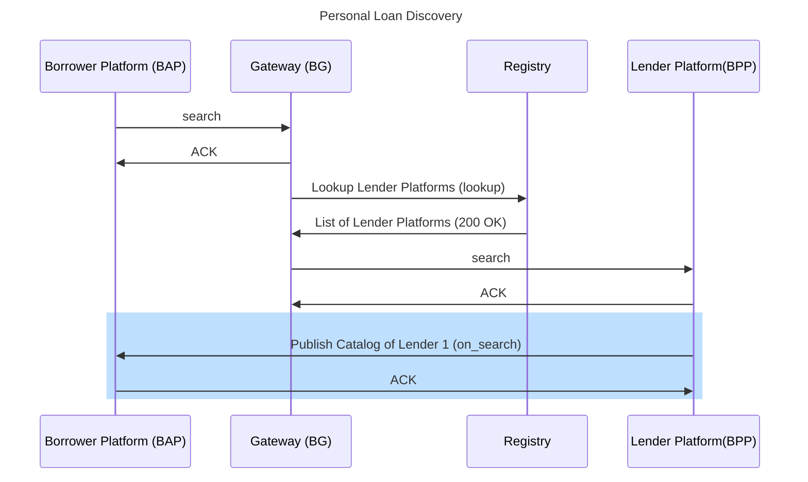
```mermaid
sequenceDiagram
  title Personal Loan Discovery
  Borrower Platform (BAP)->>Gateway (BG): search
  Gateway (BG) ->> Borrower Platform (BAP): ACK
  Gateway (BG)->>Registry: Lookup Lender Platforms (lookup)
  Registry->>Gateway (BG): List of Lender Platforms (200 OK)
  Gateway (BG)->>Lender Platform(BPP): search
  Lender Platform(BPP)->>Gateway (BG) : ACK
  rect rgb(191, 223, 255)
  Lender Platform(BPP)->>Borrower Platform (BAP): Publish Catalog of Lender 1 (on_search)
  Borrower Platform (BAP)->>Lender Platform(BPP): ACK
  end
```

## personal_loan_information_form

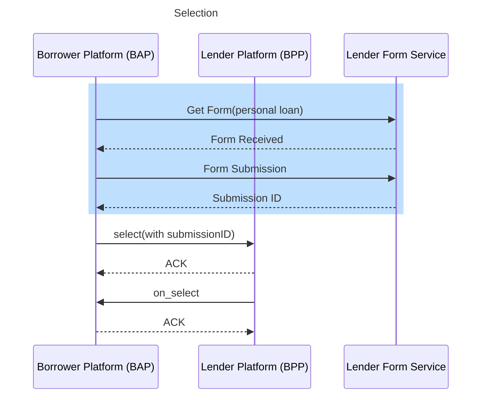
```mermaid
sequenceDiagram
  title  Selection
  participant Borrower Platform (BAP)
  participant Lender Platform (BPP)
  participant Lender Form Service
  rect rgb(191, 223, 255)
  Borrower Platform (BAP)->>Lender Form Service: Get Form(personal loan)
  Lender Form Service-->>Borrower Platform (BAP): Form Received
  Borrower Platform (BAP)->>Lender Form Service: Form Submission
  Lender Form Service-->>Borrower Platform (BAP): Submission ID
  end
  Borrower Platform (BAP)->>Lender Platform (BPP): select(with submissionID)
  Lender Platform (BPP)-->>Borrower Platform (BAP):ACK
  Lender Platform (BPP)->>Borrower Platform (BAP):on_select
  Borrower Platform (BAP)-->>Lender Platform (BPP): ACK
```

## select_3_personal_loan_3

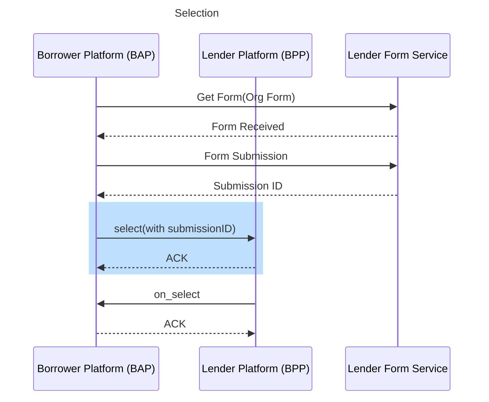
```mermaid
sequenceDiagram
  title  Selection
  participant Borrower Platform (BAP)
  participant Lender Platform (BPP)
  participant Lender Form Service
  Borrower Platform (BAP)->>Lender Form Service: Get Form(Org Form)
  Lender Form Service-->>Borrower Platform (BAP): Form Received
  Borrower Platform (BAP)->>Lender Form Service: Form Submission
  Lender Form Service-->>Borrower Platform (BAP): Submission ID
  rect rgb(191, 223, 255)
  Borrower Platform (BAP)->>Lender Platform (BPP): select(with submissionID)
  Lender Platform (BPP)-->>Borrower Platform (BAP):ACK
  end
  Lender Platform (BPP)->>Borrower Platform (BAP):on_select
  Borrower Platform (BAP)-->>Lender Platform (BPP): ACK
```

## on_select_3_personal_loan_3

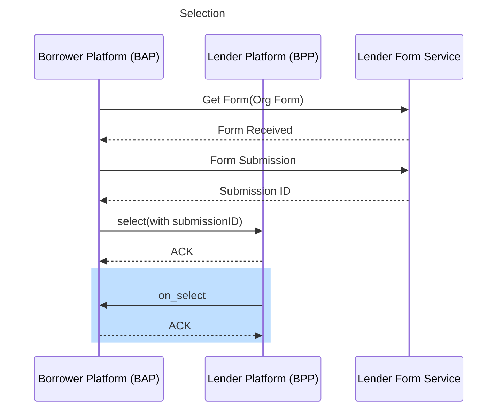
```mermaid
sequenceDiagram
  title  Selection
  participant Borrower Platform (BAP)
  participant Lender Platform (BPP)
  participant Lender Form Service
  Borrower Platform (BAP)->>Lender Form Service: Get Form(Org Form)
  Lender Form Service-->>Borrower Platform (BAP): Form Received
  Borrower Platform (BAP)->>Lender Form Service: Form Submission
  Lender Form Service-->>Borrower Platform (BAP): Submission ID
  Borrower Platform (BAP)->>Lender Platform (BPP): select(with submissionID)
  Lender Platform (BPP)-->>Borrower Platform (BAP):ACK
  rect rgb(191, 223, 255)
  Lender Platform (BPP)->>Borrower Platform (BAP):on_select
  Borrower Platform (BAP)-->>Lender Platform (BPP): ACK
  end
```

## on_status_kyc_verification

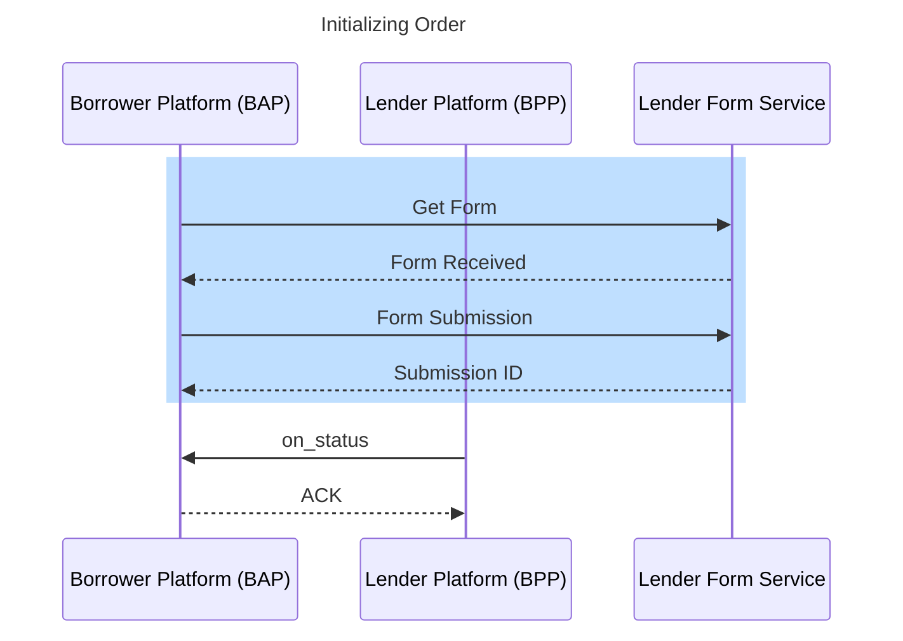
```mermaid
sequenceDiagram
  title Initializing Order
  participant Borrower Platform (BAP)
  participant Lender Platform (BPP)
  participant Lender Form Service
  rect rgb(191, 223, 255)
  Borrower Platform (BAP)->>Lender Form Service: Get Form
  Lender Form Service-->>Borrower Platform (BAP): Form Received
  Borrower Platform (BAP)->>Lender Form Service: Form Submission
  Lender Form Service-->>Borrower Platform (BAP): Submission ID
  end
  Lender Platform (BPP)->>Borrower Platform (BAP):on_status
  Borrower Platform (BAP)-->>Lender Platform (BPP): ACK
```

## on_status_latest_order_status

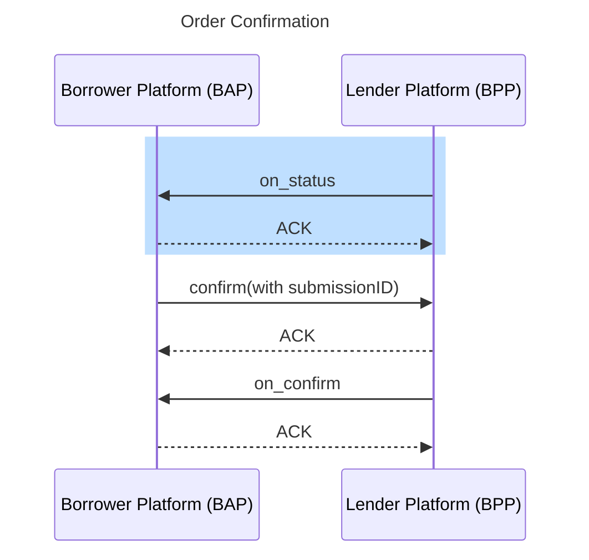
```mermaid
sequenceDiagram
  title Order Confirmation
  participant Borrower Platform (BAP)
  participant Lender Platform (BPP)
  rect rgb(191, 223, 255)
  Lender Platform (BPP)->>Borrower Platform (BAP):on_status
  Borrower Platform (BAP)-->>Lender Platform (BPP): ACK
  end
  Borrower Platform (BAP)->>Lender Platform (BPP): confirm(with submissionID)
  Lender Platform (BPP)-->>Borrower Platform (BAP):ACK
  Lender Platform (BPP)->>Borrower Platform (BAP):on_confirm
  Borrower Platform (BAP)-->>Lender Platform (BPP): ACK
```

## on_status_updated_checklists

```mermaid
sequenceDiagram
  title Order Confirmation
  participant Borrower Platform (BAP)
  participant Lender Platform (BPP)
  rect rgb(191, 223, 255)
  Lender Platform (BPP)->>Borrower Platform (BAP):on_status
  Borrower Platform (BAP)-->>Lender Platform (BPP): ACK
  end
  Borrower Platform (BAP)->>Lender Platform (BPP): confirm(with submissionID)
  Lender Platform (BPP)-->>Borrower Platform (BAP):ACK
  Lender Platform (BPP)->>Borrower Platform (BAP):on_confirm
  Borrower Platform (BAP)-->>Lender Platform (BPP): ACK
```

## on_status_order_status_checklists

```mermaid
sequenceDiagram
  title Order Confirmation
  participant Borrower Platform (BAP)
  participant Lender Platform (BPP)
  rect rgb(191, 223, 255)
  Lender Platform (BPP)->>Borrower Platform (BAP):on_status
  Borrower Platform (BAP)-->>Lender Platform (BPP): ACK
  end
  Borrower Platform (BAP)->>Lender Platform (BPP): confirm(with submissionID)
  Lender Platform (BPP)-->>Borrower Platform (BAP):ACK
  Lender Platform (BPP)->>Borrower Platform (BAP):on_confirm
  Borrower Platform (BAP)-->>Lender Platform (BPP): ACK
```

## Ekyc_details_verification_status

```mermaid
sequenceDiagram
  title Initializing Order
  participant Borrower Platform (BAP)
  participant Lender Platform (BPP)
  participant Lender Form Service
  rect rgb(191, 223, 255)
  Borrower Platform (BAP)->>Lender Form Service: Get Form
  Lender Form Service-->>Borrower Platform (BAP): Form Received
  Borrower Platform (BAP)->>Lender Form Service: Form Submission
  Lender Form Service-->>Borrower Platform (BAP): Submission ID
  end
  Lender Platform (BPP)->>Borrower Platform (BAP):on_status
  Borrower Platform (BAP)-->>Lender Platform (BPP): ACK
```

## status_personal_loan_3

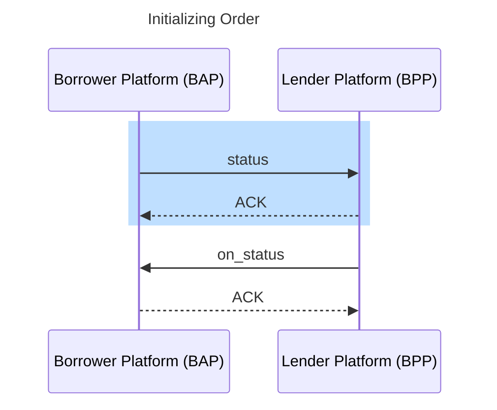
```mermaid
sequenceDiagram
  title Initializing Order
  participant Borrower Platform (BAP)
  participant Lender Platform (BPP)
  rect rgb(191, 223, 255)
  Borrower Platform (BAP)->>Lender Platform (BPP): status
  Lender Platform (BPP)-->>Borrower Platform (BAP):ACK
  end
  Lender Platform (BPP)->>Borrower Platform (BAP):on_status
  Borrower Platform (BAP)-->>Lender Platform (BPP): ACK
```

## on_status_personal_loan_3

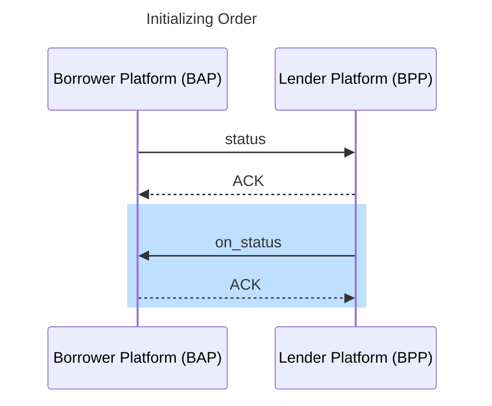
```mermaid
sequenceDiagram
  title Initializing Order
  participant Borrower Platform (BAP)
  participant Lender Platform (BPP)
  Borrower Platform (BAP)->>Lender Platform (BPP): status
  Lender Platform (BPP)-->>Borrower Platform (BAP):ACK
  rect rgb(191, 223, 255)
  Lender Platform (BPP)->>Borrower Platform (BAP):on_status
  Borrower Platform (BAP)-->>Lender Platform (BPP): ACK
  end
```

## confirm_personal_loan_3

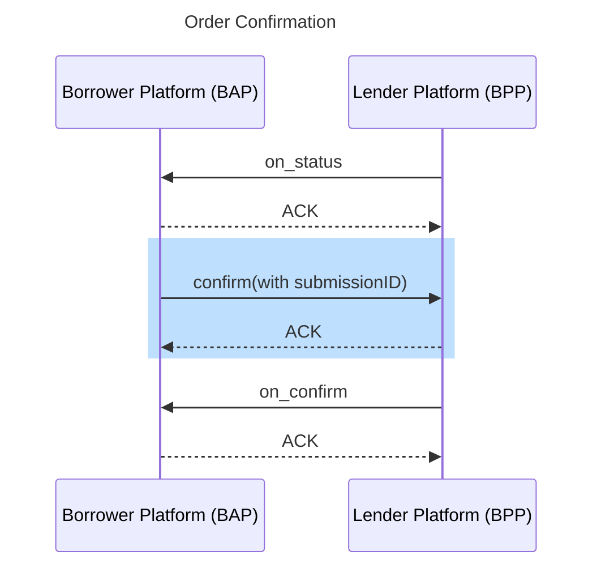
```mermaid
sequenceDiagram
  title Order Confirmation
  participant Borrower Platform (BAP)
  participant Lender Platform (BPP)
  Lender Platform (BPP)->>Borrower Platform (BAP):on_status
  Borrower Platform (BAP)-->>Lender Platform (BPP): ACK
  rect rgb(191, 223, 255)
  Borrower Platform (BAP)->>Lender Platform (BPP): confirm(with submissionID)
  Lender Platform (BPP)-->>Borrower Platform (BAP):ACK
  end
  Lender Platform (BPP)->>Borrower Platform (BAP):on_confirm
  Borrower Platform (BAP)-->>Lender Platform (BPP): ACK
```

## on_confirm_personal_loan_3

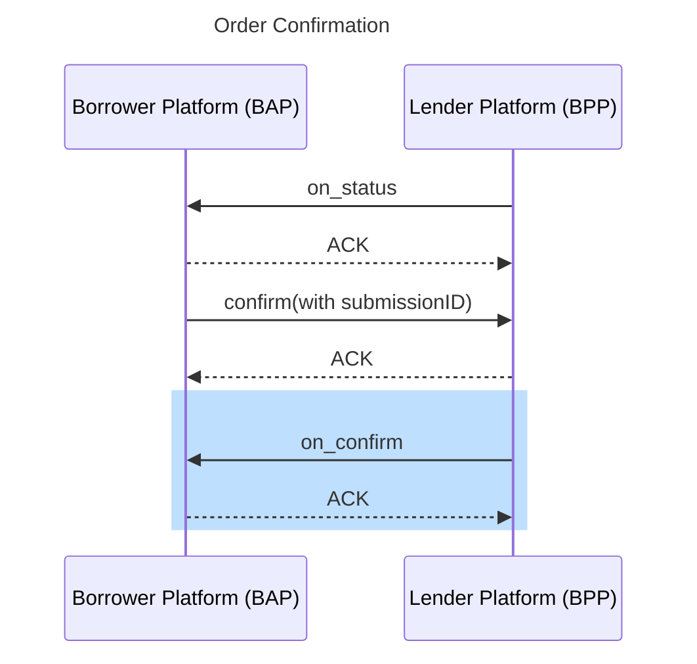
```mermaid
sequenceDiagram
  title Order Confirmation
  participant Borrower Platform (BAP)
  participant Lender Platform (BPP)
  Lender Platform (BPP)->>Borrower Platform (BAP):on_status
  Borrower Platform (BAP)-->>Lender Platform (BPP): ACK
  Borrower Platform (BAP)->>Lender Platform (BPP): confirm(with submissionID)
  Lender Platform (BPP)-->>Borrower Platform (BAP):ACK
  rect rgb(191, 223, 255)
  Lender Platform (BPP)->>Borrower Platform (BAP):on_confirm
  Borrower Platform (BAP)-->>Lender Platform (BPP): ACK
  end
```

## issue_open_100

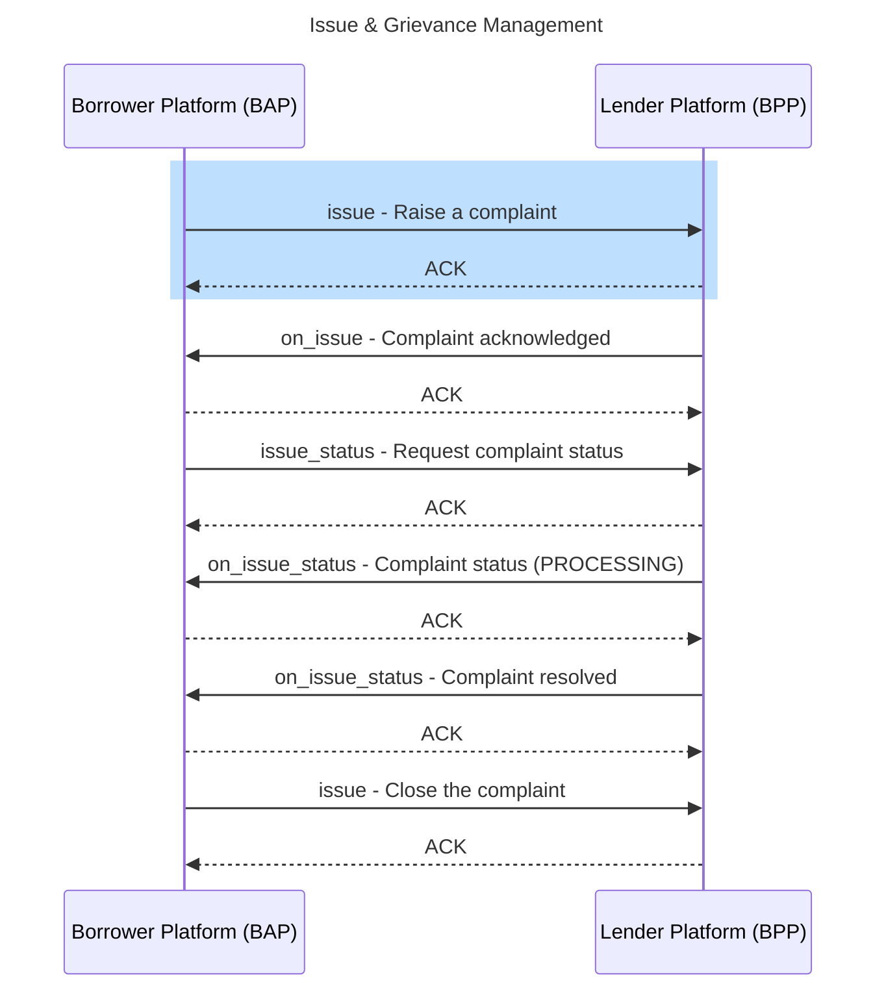
```mermaid
sequenceDiagram
  title Issue & Grievance Management
  participant Borrower Platform (BAP)
  participant Lender Platform (BPP)
  rect rgb(191, 223, 255)
  Borrower Platform (BAP)->>Lender Platform (BPP): issue - Raise a complaint
  Lender Platform (BPP)-->>Borrower Platform (BAP): ACK
  end
  Lender Platform (BPP)->>Borrower Platform (BAP): on_issue - Complaint acknowledged
  Borrower Platform (BAP)-->>Lender Platform (BPP): ACK
  Borrower Platform (BAP)->>Lender Platform (BPP): issue_status - Request complaint status
  Lender Platform (BPP)-->>Borrower Platform (BAP): ACK
  Lender Platform (BPP)->>Borrower Platform (BAP): on_issue_status - Complaint status (PROCESSING)
  Borrower Platform (BAP)-->>Lender Platform (BPP): ACK
  Lender Platform (BPP)->>Borrower Platform (BAP): on_issue_status - Complaint resolved
  Borrower Platform (BAP)-->>Lender Platform (BPP): ACK
  Borrower Platform (BAP)->>Lender Platform (BPP): issue - Close the complaint
  Lender Platform (BPP)-->>Borrower Platform (BAP): ACK
```

## on_issue_processing_100

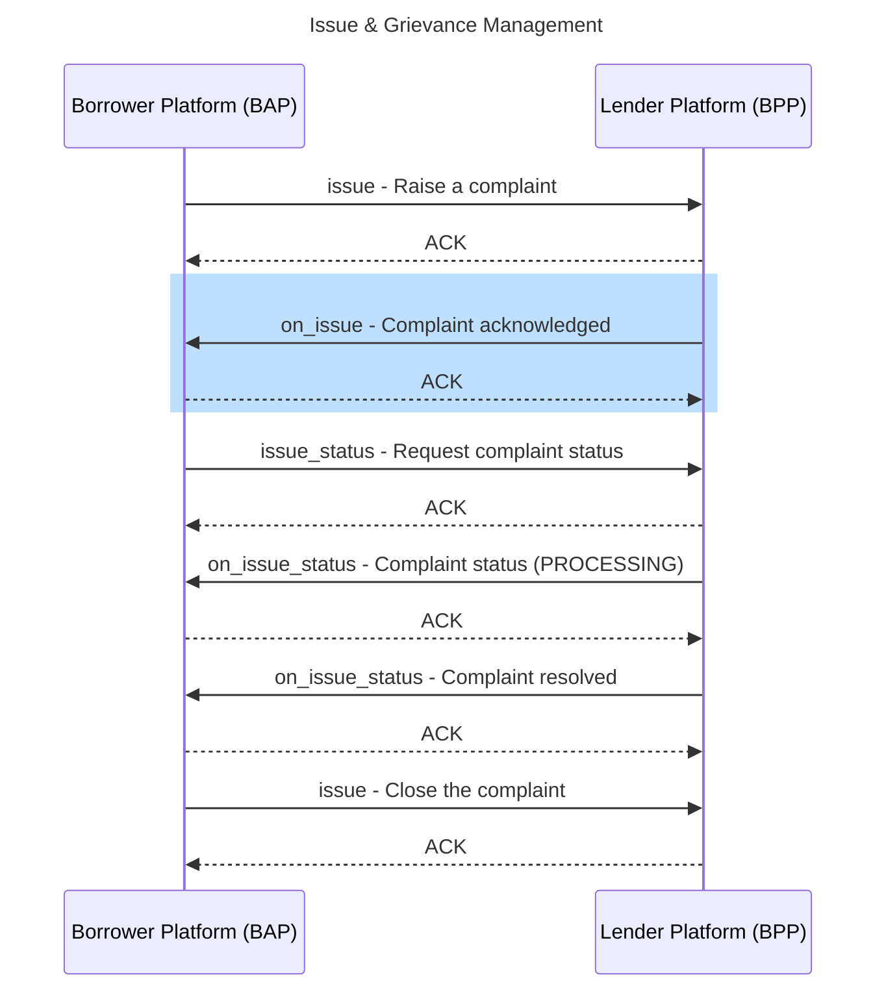
```mermaid
sequenceDiagram
  title Issue & Grievance Management
  participant Borrower Platform (BAP)
  participant Lender Platform (BPP)
  Borrower Platform (BAP)->>Lender Platform (BPP): issue - Raise a complaint
  Lender Platform (BPP)-->>Borrower Platform (BAP): ACK
  rect rgb(191, 223, 255)
  Lender Platform (BPP)->>Borrower Platform (BAP): on_issue - Complaint acknowledged
  Borrower Platform (BAP)-->>Lender Platform (BPP): ACK
  end
  Borrower Platform (BAP)->>Lender Platform (BPP): issue_status - Request complaint status
  Lender Platform (BPP)-->>Borrower Platform (BAP): ACK
  Lender Platform (BPP)->>Borrower Platform (BAP): on_issue_status - Complaint status (PROCESSING)
  Borrower Platform (BAP)-->>Lender Platform (BPP): ACK
  Lender Platform (BPP)->>Borrower Platform (BAP): on_issue_status - Complaint resolved
  Borrower Platform (BAP)-->>Lender Platform (BPP): ACK
  Borrower Platform (BAP)->>Lender Platform (BPP): issue - Close the complaint
  Lender Platform (BPP)-->>Borrower Platform (BAP): ACK
```

## issue_status_processing_100

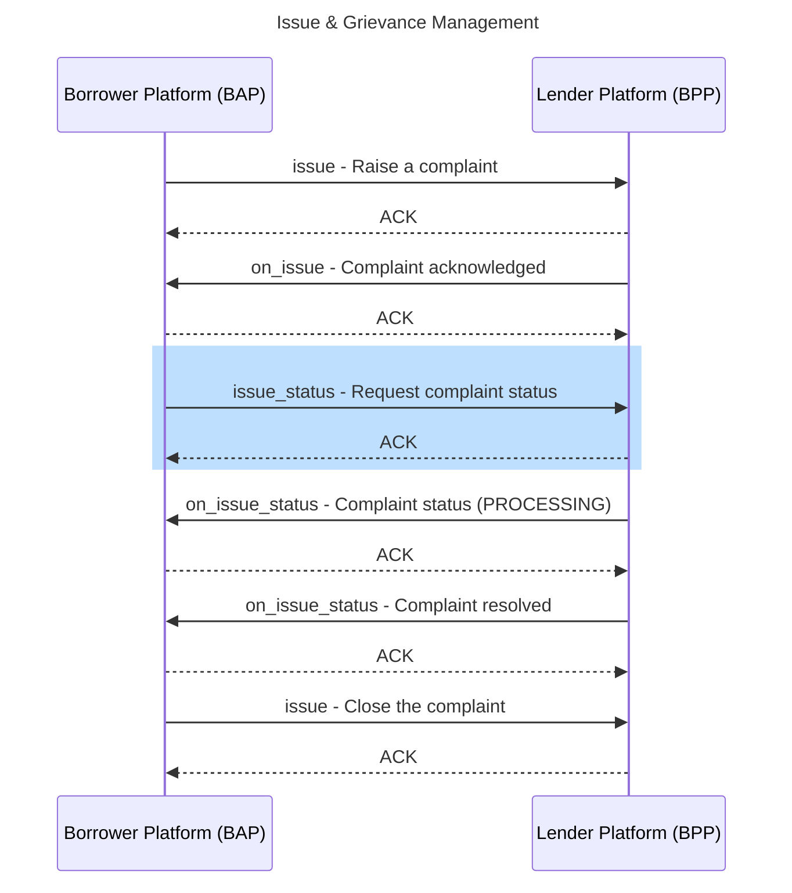
```mermaid
sequenceDiagram
  title Issue & Grievance Management
  participant Borrower Platform (BAP)
  participant Lender Platform (BPP)
  Borrower Platform (BAP)->>Lender Platform (BPP): issue - Raise a complaint
  Lender Platform (BPP)-->>Borrower Platform (BAP): ACK
  Lender Platform (BPP)->>Borrower Platform (BAP): on_issue - Complaint acknowledged
  Borrower Platform (BAP)-->>Lender Platform (BPP): ACK
  rect rgb(191, 223, 255)
  Borrower Platform (BAP)->>Lender Platform (BPP): issue_status - Request complaint status
  Lender Platform (BPP)-->>Borrower Platform (BAP): ACK
  end
  Lender Platform (BPP)->>Borrower Platform (BAP): on_issue_status - Complaint status (PROCESSING)
  Borrower Platform (BAP)-->>Lender Platform (BPP): ACK
  Lender Platform (BPP)->>Borrower Platform (BAP): on_issue_status - Complaint resolved
  Borrower Platform (BAP)-->>Lender Platform (BPP): ACK
  Borrower Platform (BAP)->>Lender Platform (BPP): issue - Close the complaint
  Lender Platform (BPP)-->>Borrower Platform (BAP): ACK
```

## on_issue_status_processing_100

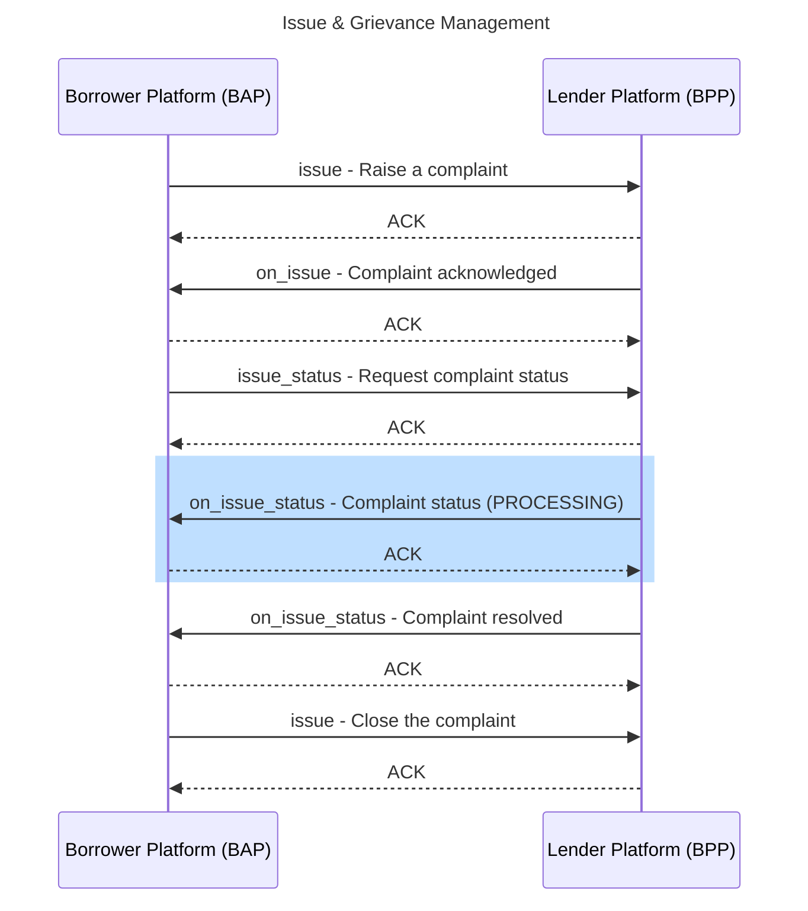
```mermaid
sequenceDiagram
  title Issue & Grievance Management
  participant Borrower Platform (BAP)
  participant Lender Platform (BPP)
  Borrower Platform (BAP)->>Lender Platform (BPP): issue - Raise a complaint
  Lender Platform (BPP)-->>Borrower Platform (BAP): ACK
  Lender Platform (BPP)->>Borrower Platform (BAP): on_issue - Complaint acknowledged
  Borrower Platform (BAP)-->>Lender Platform (BPP): ACK
  Borrower Platform (BAP)->>Lender Platform (BPP): issue_status - Request complaint status
  Lender Platform (BPP)-->>Borrower Platform (BAP): ACK
  rect rgb(191, 223, 255)
  Lender Platform (BPP)->>Borrower Platform (BAP): on_issue_status - Complaint status (PROCESSING)
  Borrower Platform (BAP)-->>Lender Platform (BPP): ACK
  end
  Lender Platform (BPP)->>Borrower Platform (BAP): on_issue_status - Complaint resolved
  Borrower Platform (BAP)-->>Lender Platform (BPP): ACK
  Borrower Platform (BAP)->>Lender Platform (BPP): issue - Close the complaint
  Lender Platform (BPP)-->>Borrower Platform (BAP): ACK
```

## on_issue_resolved_100

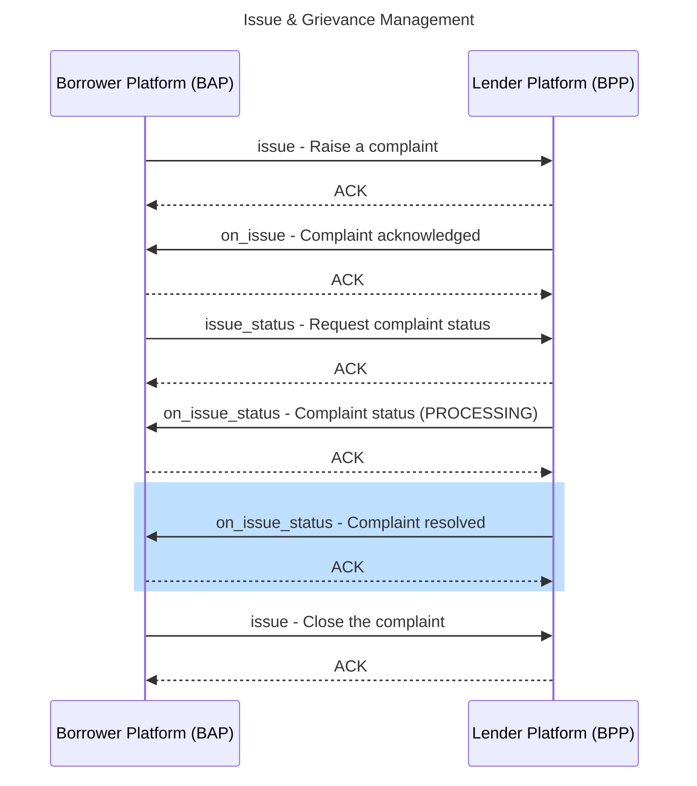
```mermaid
sequenceDiagram
  title Issue & Grievance Management
  participant Borrower Platform (BAP)
  participant Lender Platform (BPP)
  Borrower Platform (BAP)->>Lender Platform (BPP): issue - Raise a complaint
  Lender Platform (BPP)-->>Borrower Platform (BAP): ACK
  Lender Platform (BPP)->>Borrower Platform (BAP): on_issue - Complaint acknowledged
  Borrower Platform (BAP)-->>Lender Platform (BPP): ACK
  Borrower Platform (BAP)->>Lender Platform (BPP): issue_status - Request complaint status
  Lender Platform (BPP)-->>Borrower Platform (BAP): ACK
  Lender Platform (BPP)->>Borrower Platform (BAP): on_issue_status - Complaint status (PROCESSING)
  Borrower Platform (BAP)-->>Lender Platform (BPP): ACK
  rect rgb(191, 223, 255)
  Lender Platform (BPP)->>Borrower Platform (BAP): on_issue_status - Complaint resolved
  Borrower Platform (BAP)-->>Lender Platform (BPP): ACK
  end
  Borrower Platform (BAP)->>Lender Platform (BPP): issue - Close the complaint
  Lender Platform (BPP)-->>Borrower Platform (BAP): ACK
```

## issue_close_100

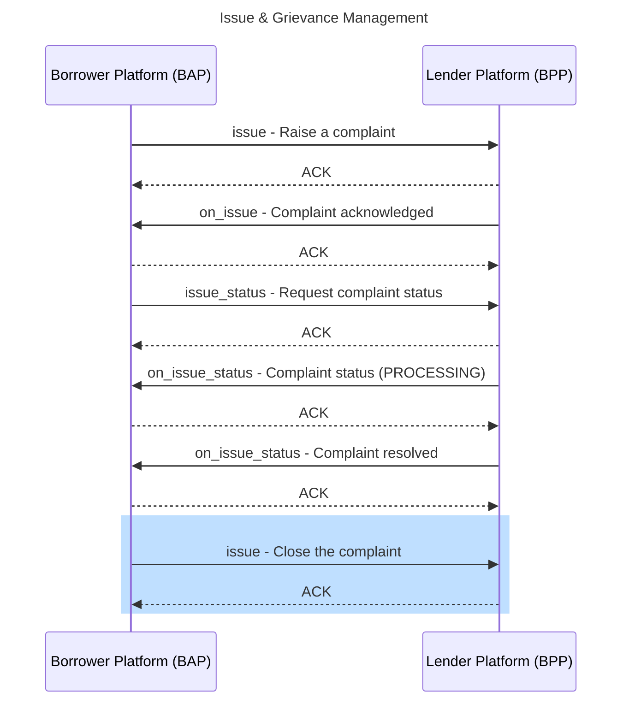
```mermaid
sequenceDiagram
  title Issue & Grievance Management
  participant Borrower Platform (BAP)
  participant Lender Platform (BPP)
  Borrower Platform (BAP)->>Lender Platform (BPP): issue - Raise a complaint
  Lender Platform (BPP)-->>Borrower Platform (BAP): ACK
  Lender Platform (BPP)->>Borrower Platform (BAP): on_issue - Complaint acknowledged
  Borrower Platform (BAP)-->>Lender Platform (BPP): ACK
  Borrower Platform (BAP)->>Lender Platform (BPP): issue_status - Request complaint status
  Lender Platform (BPP)-->>Borrower Platform (BAP): ACK
  Lender Platform (BPP)->>Borrower Platform (BAP): on_issue_status - Complaint status (PROCESSING)
  Borrower Platform (BAP)-->>Lender Platform (BPP): ACK
  Lender Platform (BPP)->>Borrower Platform (BAP): on_issue_status - Complaint resolved
  Borrower Platform (BAP)-->>Lender Platform (BPP): ACK
  rect rgb(191, 223, 255)
  Borrower Platform (BAP)->>Lender Platform (BPP): issue - Close the complaint
  Lender Platform (BPP)-->>Borrower Platform (BAP): ACK
  end
```
